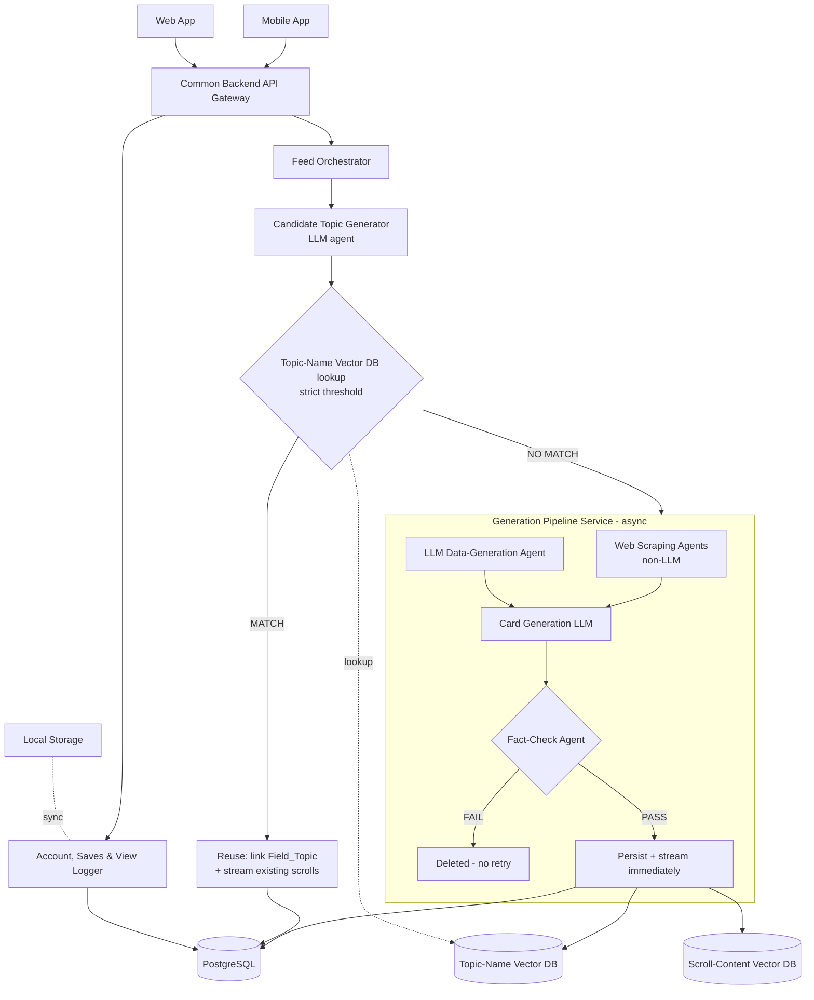

# InstaCram — Build Plan

InstaCram is a field-scoped, scroll-based microlearning app: the user names a field of interest ("Java Collections", "Behavioural Economics"), and the app serves an endless feed of one-page, single-topic cards drawn from it. The unit of content is not a video but a microlesson readable in the time it takes to watch one reel. It exists because short-form scrolling has already won the attention slot, and the useful move is to put something worth reading into that slot rather than argue people out of it. Its scope is deliberately narrow: it primes you on concepts you will meet later, and it refreshes material you half-learned once. It does not teach complex subjects from zero — that boundary is a design decision, recorded in [DECISIONS.md](DECISIONS.md), not a gap waiting to be filled.

Audience for this document: anyone who opens the repo — the author, a teammate, a third party evaluating it.

Throughout these files, ★ marks **a non-obvious engineering decision — the part worth asking about**.

---

## 1. Tech Stack

| Layer | Tool | Why this one |
|---|---|---|
| Serving / Read Service | Node.js + Express + TypeScript | The read path is the half that must ship fast and stay boring. Chosen for the lowest-risk option with the most existing author experience (4+ prior projects), so risk budget is spent on the pipeline instead. |
| Generation Pipeline Service | Python + FastAPI | Async-native. The pipeline is scrape + several LLM calls + fact-check per topic, all I/O-bound and all parallelisable; the concurrency model is the deciding factor, not the language. |
| Agent orchestration | LangGraph | The pipeline is a graph with a real branch (fact-check pass/fail → persist or delete), not a linear chain. LangGraph models branching explicitly rather than by convention. Prior experience exists (TreasuryPulse). |
| LLM provider layer | LiteLLM, self-hosted as its own gateway service | Both backend services call one OpenAI-compatible endpoint, so the model is a config value, not a code dependency. Gives provider swap and cross-provider fallback for free. **Default: Ollama on the host** (`qwen3:8b`), so there is no API key and no per-call cost; swapping to a hosted provider is an edit to `config.yaml` alone. |
| Relational DB | PostgreSQL | System of record for `Field`, `Topic`, `Field_Topic`, `Scroll`, `Account`, `User_View`. The data is relational — a many-to-many junction is load-bearing (§3) — so a relational store is the honest fit. |
| Vector DBs (×2) | Qdrant, self-hosted via Docker | Runs in the same Docker/K8s story as everything else, with no per-month floor and no vendor account required to run the project locally. Usable Python *and* Node clients, which matters because both services touch it. |
| Embeddings | Self-hosted sentence-transformers via Hugging Face text-embeddings-inference, pinned to `cpu-1.9.3` (P19) | The highest-volume model call in the system — ~20 candidates on every field request, against a handful of LLM calls only on a miss. Self-hosting removes per-call cost and a network round-trip from the hottest path. **The specific model is chosen by measurement, not reputation:** the W3 calibration sweep runs across `all-MiniLM-L6-v2` (384d), `bge-base-en-v1.5` (768d) and `e5-base-v2` (768d), and whichever best separates the polysemy collision pairs wins. Dimension is fixed at Qdrant collection creation, so this settles first. |
| Feed delivery | Paginated HTTP, ~10 scrolls per page, client prefetches at ~3 remaining | Matches how a scroll feed is used, keeps the server stateless per request, and needs no second transport. On a cache miss the same endpoint returns a partial page plus `generating: true` and the client re-polls — see §4.3. Deliberately not SSE: React Native has no native `EventSource`, so SSE would need a polyfill on mobile while polling is an identical `fetch` on both clients. |
| Web scraping | **Plain HTTP (`httpx`) — Playwright not needed** | Originally chosen as dual-purpose: one library for scraping and browser E2E. The spike settled it the other way. 10/10 topics retrieved over documented HTTP APIs in ~1.1s each, and a browser is only required for pages that render content with JavaScript — which neither source does. Playwright stays in the stack for **E2E testing only**. Discovering a browser is unnecessary is itself a useful result: it removes a heavy dependency from the hot path. Retrieval was never the hard part, though — see §4.5 and DECISIONS.md P26. |
| Auth | Firebase Auth | Already implemented once (GoRide). Auth is not where this project is trying to be interesting; buying it back as a managed service preserves time for the pipeline. |
| Testing | Playwright + Selenium, unit + integration | Explicit project requirement. Playwright overlaps with the scraper (above). |
| Containerisation | Docker | Two services in two different languages, plus Postgres and Qdrant. Containers are what make that reproducible on one machine. |
| Orchestration | Kubernetes on GCP (GKE) | See §1.1 — chosen on a pricing comparison, not preference. |
| CI/CD | GitHub Actions | Free for this repo; runs Docker builds, Playwright/Selenium suites and the K8s deploy in one place. |
| Monitoring | Prometheus + Grafana | Explicit project requirement. The two services have different failure profiles (§2), so per-service metrics are needed to tell "slow" from "broken". |
| Mobile client | React Native (Expo) — **UNCONFIRMED** | Proposed from prior project history, never explicitly agreed. Flagged in [FEATURES.md](FEATURES.md) open items. Do not treat as decided. |
| Web client | Next.js (React) — **UNCONFIRMED** | Same caveat. |

### 1.1 Deliberately not used

| Not used | Instead | Why |
|---|---|---|
| AWS EKS | GKE | EKS charges a flat ~$0.10/hr (~$73/mo) control-plane fee with no free-tier equivalent. GKE carries a standing $74.40/month credit covering one zonal cluster's management fee. For a project intended to run continuously on a personal budget, that is the difference between ~$73/mo and ~$0/mo. Secondary benefit: the author already has deep AWS experience (CVMS), so GCP adds breadth rather than repeating it. |
| Managed vector SaaS (e.g. Pinecone) | Self-hosted Qdrant | A managed-only vector DB cannot be run on a laptop or in a local `kind` cluster without an account and a network dependency, which breaks the "clone and run" story and adds recurring cost. |
| One unified backend language | Node for serving, Python for the pipeline | The two services have genuinely different demands (§2). Forcing one language optimises for tidiness over fit. The cost — two toolchains, two test setups — is accepted knowingly. |
| Hand-rolled JWT / RBAC | Firebase Auth | Deferred to phase 2, not rejected. It is a reasonable later upgrade; it is not worth blocking the first working feed on. |
| Redis as system of record | Postgres table for `User_View` | Redis is flagged as a possible later cache layer. Making it the store of record for view history would risk losing exactly the data that cannot be reconstructed (§4.4). |
| A retry queue for fact-check failures | Quarantine the draft, no retry | v1 does not retry. The rejected text is kept for diagnosis and the rejection rate is counted, so reversing this later is an evidence-based call rather than a guess (§4.3). |
| A meaning-disambiguation stage in topic matching | Strict-threshold name matching only | ★ The single most consequential simplification in the design. Full reasoning in §4.2. |
| Streaks / daily goals | Nothing | In direct tension with the project's own stated motivation (reducing dependence on engagement-loop apps). If ever added, it must be a deliberate decision, not a default. |

---

## 2. Architecture



**Common Backend API Gateway** — single entry point for both clients, so mobile and web consume an identical API. Routes requests and hands off authentication. Depends on nothing downstream being healthy to accept a request; it must fail per-route, not globally.

**Feed Orchestrator** (Serving) — receives a field-of-interest request, drives candidate generation, runs the cache lookup, and streams scrolls back. This is the only component that knows the whole request story; everything it calls is replaceable behind it.

**Candidate Topic Generator** (Serving, LLM agent) — in: a field name. Out: a list of candidate topic names. Sits in the *serving* service rather than the pipeline because it runs on every field request, including cache hits where no generation happens at all.

**Account, Saves & View Logger** (Serving) — login/signup, saves (the `saved_scroll` table), and one row per scroll impression. **Independent of the entire feed path.** It can be built, tested and deployed with no pipeline in existence, which makes it the right first slice of real code.

**Web Scraping Agents** (Pipeline, non-LLM) — pulls raw source material and source URLs for a topic. The output is grounding context only and is never served verbatim (§4.5).

**LLM Data-Generation Agent** (Pipeline) — generates supplementary explanatory material for gaps the scrape misses. **Independent of the scraper** — the two have no data dependency on each other and should run concurrently. This is the main parallelism available inside the pipeline.

**Card Generation LLM** (Pipeline) — joins both inputs into multiple one-page draft cards. Depends on both of the above completing.

**Fact-Check Agent** (Pipeline) — the sole quality gate. Verifies each draft against the gathered source material. Fail → quarantined (not deleted; §4.3). Pass → persisted and streamed at once.

**A source larger than one context window is chunked, not truncated.** This is not an optimisation but a correctness requirement, learned the hard way (P33): the runtime silently drops the *front* of an over-long prompt, which is where the card sits, and then answers confidently about material it was never shown. Chunked checking uses a **different prompt** from single-pass, with a three-way per-fragment verdict where **only contradiction is decisive** — a claim's absence from one fragment is not evidence against it, and treating it as evidence would reject nearly every card, permanently, since v1 has no retry. Because a gate is the one component whose failure mode is looking perfect, its accuracy is asserted by a **negative control** that plants known-false claims and requires them to be caught, alongside faithful controls that must still pass.

**Data stores** — Postgres (system of record), two Qdrant collections, and client-side local storage. The two vector collections are independent of each other: one is written at topic creation and read at lookup, the other is written at scroll creation and read by future search. Neither needs the other to function.

### 2.1 Dependency summary

| Component | Depends on | Independent of |
|---|---|---|
| Account / Saves / View Logger | Postgres, Firebase Auth | The entire feed and pipeline |
| Feed Orchestrator | Candidate Topic Generator, Topic-Name VDB, Postgres | The pipeline on a cache hit |
| Generation Pipeline | LiteLLM gateway, network access | The serving service, once triggered |
| Scraper ↔ Data-Gen agent | — | Each other (run in parallel) |
| Scroll-Content VDB | Pipeline writes | Serving path in v1 (nothing reads it yet) |

The two services are split precisely because their failure profiles differ: the serving path must stay fast and available; the pipeline is slow, bursty, and allowed to fail for one topic without taking a feed down.

---

## 3. Data / Domain Model

### 3.1 Entities

| Entity | Shape | Notes |
|---|---|---|
| `Field` | `{ id, name }` | What the user types. |
| `Topic` | `{ id, name, description, status }` | A discrete concept. **Not owned by any field.** `description` is the candidate-generator one-liner and is the text that gets embedded (§4.2). `status` ∈ `pending` \| `ready` \| `empty` (§4.3). |
| `Field_Topic` | `{ field_id, topic_id }` | Junction, many-to-many. ★ The structural decision the whole reuse design rests on. |
| `Scroll` | `{ id, topic_id, content, source_url, trust_label, why_it_matters, recall_prompt, recall_answer, retired_at }` | One card. A topic has 1:N scrolls. **Never deleted, only retired** (invariant 12). Every read goes through the `live_scroll` view, which hides retired cards. |
| `Rejected_Draft` | `{ id, topic_id, content, reason, rejected_at }` | Quarantine. Drafts that failed fact-check, kept for diagnosis. **Separate table by design** — never a flag on `Scroll` (§4.3). Capped at the last **N=20 per topic** (raised from 5 in migration `002`, see DECISIONS.md P14); the long-term trend lives in the counters instead. |
| `Topic_Generation_Stats` | `{ topic_id, drafts_generated, drafts_passed, drafts_failed, runs, run_at }` | Per-topic fact-check counters (§4.3). `runs` > 1 means the topic came back empty and was retried; it exists because retries have no attempt limit (migration `003`). |
| `Outbox` | `{ id, topic_id, payload, created_at, processed_at }` | Written in the same transaction as a `Topic` row; drained into Qdrant by a worker (§4.6). |
| `Account` | `{ id, firebase_uid, email }` | Identity only. Saves moved to `Saved_Scroll` in migration `004`. |
| `Saved_Scroll` | `{ account_id, scroll_id, saved_at }` | One row per saved card. Real foreign keys (invariant 8), and `saved_at` gives `GET /v1/saves` its newest-first order. Replaced a `saved_scroll_ids[]` array; see DECISIONS.md P18. |
| `Erasure_Log` | `{ id, erased_at, views_removed, saves_removed }` | One row per account erasure. **Holds no identifier, by design**: it records that an erasure happened and how much it removed, never whose (invariant 13). |
| `User_View` | `{ user_id, scroll_id, viewed_at }` | Append-only impression log. |

### 3.2 Invariants that must always hold

1. A `Scroll` belongs to exactly one `Topic`. A `Topic` may belong to many `Field`s, and a `Field` to many `Topic`s, only through `Field_Topic`.
2. `Field_Topic` is unique on `(field_id, topic_id)`. Re-requesting a field must never create duplicate links.
3. A `Topic` is never duplicated to give a field its own copy. If the same concept is wanted under a second field, that is a new junction row and nothing else.
4. Every persisted `Scroll` has a non-null `source_url` and a non-null `trust_label`. A card with no provenance must not be servable — this is the mechanism that makes the trust claim real rather than aspirational.
5. Every `Topic` row in Postgres has exactly one corresponding vector in the Topic-Name Vector DB. These are two separate systems with no shared transaction, so the invariant is enforced by the outbox, not by the database; see §4.6.
6. **A `Topic` may legitimately have zero `Scroll`s**, if every draft failed fact-check. Such a topic carries `status = 'empty'`, is **reported to the user** in `failed_topics`, and is **never served as a hit**. It is retried only by a candidate-generation event: the field's next "more topics" tap, or another field proposing it. Paging and polling never retry it (§4.3, DECISIONS.md P16, P17).
7. `User_View` is append-only, and a row is written **when a card is displayed, never when it is fetched** — prefetch means those differ by up to a page (§4.4, P12). It is also the feed's paging mechanism: a page is "scrolls this user has not viewed", so the log is load-bearing for feed correctness, not merely a future-facing record. **The one exception to append-only is account erasure** (invariant 13).
8. Every `Saved_Scroll` row references an existing account and an existing scroll. Foreign keys have enforced this since migration `004`; while saves were an array it couldn't be enforced at all (P18). Because scrolls are never deleted (invariant 12), a saved card can't disappear from under a save. A retired one is hidden instead.
9. **`Topic.description` is written once, by the Candidate Topic Generator, and never rewritten.** It is the text that gets embedded, so changing it silently shifts every similarity score involving that topic. A richer human-facing description, if ever wanted, is a separate column that is never embedded (§4.2).
10. Rows in `Rejected_Draft` are never served, never promoted to `Scroll`, and never joined into a feed query. The table exists for diagnosis only.
11. `Outbox` rows are written in the same transaction as the `Topic` they describe. A topic is never inserted without its outbox row (§4.6).
12. **A `Scroll` is never hard-deleted.** A card leaving circulation gets `retired_at`, and a trigger rejects every delete. Every read path queries the `live_scroll` view, never `scroll` directly. Deleting would have to erase the card's view history, which is the one dataset that can't be rebuilt (P20).
13. **An `Account` is removed only through `erase_account()`.** It deletes the account, its views and its saves in one transaction, and writes an `Erasure_Log` row with counts but no identifier. A raw `DELETE FROM account` is rejected. The view log accepts a delete only when it arrives as a cascade from that erasure, so history can never be trimmed selectively (P21). These rules guard against mistakes. Guarding against a compromised application needs database roles (W7).

---

## 4. Core Logic

### 4.1 Cache-then-generate

**Computes:** whether a requested topic needs generating at all.

Every candidate topic name is checked against existing content *before* the pipeline is allowed to run. On a hit, the pipeline is never invoked: a junction row is written and the existing scrolls stream immediately. On a miss, generation is triggered asynchronously for that one topic.

**Assumes:** that generation is expensive relative to a vector lookup (true — one is ~4 LLM calls plus a scrape, the other is a single ANN query), and that reuse across fields is common enough to matter.

**Breaks when:** the corpus is empty. At cold start every request is a miss, so the very first user of a field pays full pipeline latency for every topic. Streaming (§4.3) is what makes that tolerable; nothing else in the design addresses it.

### 4.2 ★ Cross-field topic matching — strict threshold only

**Computes:** whether a proposed topic name already exists in the system.

Each candidate name is embedded and searched against the Topic-Name Vector DB. Above the similarity threshold → reuse. Below → generate.

*Worked example.* "HashMap" exists under *Java Utils* with 3 scrolls. A user requests *Java Collections*. Candidate generation proposes "HashMap"; the lookup hits; one `Field_Topic` row is written; those same 3 scrolls now appear under Java Collections at zero generation cost. "TreeSet" does not match, so it runs the full pipeline as a new topic.

**Assumes:** that name-embedding similarity is a usable proxy for concept identity.

**Breaks when:** it is not. Two failure directions, and they are not symmetric:

- *False merge (dangerous).* "Stack" under **Web Development** means a technology stack. "Stack" under **DSA** means the data structure. Identical string, near-identical embedding, unrelated concepts. A merge here silently serves the wrong content under a field, and nothing in the system would report it.
- *False split (cheap).* Two genuinely equivalent topics phrased differently fall below the threshold, and one gets generated twice. The cost is wasted LLM spend and a duplicate row.

**The v1 decision:** run name-embedding similarity with a strict threshold and **no disambiguation stage**. This deliberately biases toward false splits, because a bad merge silently corrupts content while a redundant topic is merely waste. The proper fix — coarse retrieval by name, then a second-stage check (longer-description embedding, or an LLM confirming genuine concept equivalence) before reuse is permitted — is specified and deferred. It is added only if bad merges actually appear on real data, not preemptively.

**What gets embedded, and why it is symmetric.** The Candidate Topic Generator emits a **one-line description alongside each candidate name**, and the vector compared at lookup time is `embed(name + description)`. On a cache miss, that same one-liner is stored as the new topic's `description` — so both sides of every future comparison are produced by the same model, from the same prompt, at the same length. This matters more than it sounds: an earlier version of this design embedded `name + description` on the index side but queried with a bare name, an asymmetric comparison that depresses scores exactly where a strict threshold is least able to absorb it. Cost measured at roughly 400 extra output tokens per field request, against several LLM calls per cache miss — negligible. Invariant 9 (§3.2) is what keeps the symmetry from decaying later. See [DECISIONS.md](DECISIONS.md) P9.

**Calibrating the threshold.** **No value has been chosen, and none should be guessed.** The procedure, which needs only the candidate generator and an embedding model — no pipeline, so it can run in phase P1:

1. Pick 8–10 fields with deliberate overlap (*Java Utils* / *Java Collections* / *DSA*) and deliberate collision (*Web Development* / *DSA*, both yielding "Stack").
2. Generate candidates, embed, compute the pairwise similarity matrix.
3. Hand-label ~50 pairs as same-concept or different-concept.
4. Sweep the threshold and **take the lowest value at which false merges = 0.** Accept whatever split rate falls out.

Step 4 is the asymmetry above, written into the calibration procedure rather than left to whoever picks the number.

### 4.3 Fact-check gate and stream-on-pass

**Computes:** whether a draft card is allowed to reach a user, and when.

Each draft is verified against the source material gathered by the scraper and the data-gen agent. **Fail → not served, no retry, no re-queue.** **Pass → persisted and available to the next page request immediately**, without waiting for the rest of the batch.

**Assumes:** that the fact-checker's failures are mostly true positives, and that a partially-filled feed is better than a delayed complete one.

**Breaks when:** the checker is systematically over-strict. With no retry every rejection is permanent, so a topic can end up with zero surviving cards (invariant 6). Left alone that failure is not merely invisible — it is *cached*. The topic row exists and is embedded, so every future field proposing that topic hits the cache, skips the pipeline, and serves nothing, looking exactly like a healthy cache hit. No-retry and topic-reuse combine into this; neither produces it alone.

**Three mitigations, all shipping with the pipeline in phase P3, none of which reverse the no-retry decision:**

| Mechanism | Purpose |
|---|---|
| `Topic_Generation_Stats` — per-topic pass/fail counts | Makes the rejection rate a number someone can look up. Without it there is no signal at all. |
| `Topic.status` = `pending` \| `ready` \| `empty` | Makes the zero-card topic representable, and makes the lookup treat `empty` as a **miss** rather than a hit — which is what stops the failure being cached and re-served (invariant 6). |
| `Rejected_Draft` quarantine table | Keeps the rejected text. An over-strict fact-checker and a bad card generator produce the *identical* rejection number; only the text separates them. This is the difference between detecting a problem and diagnosing it. |

The quarantine is a **separate table, never a flag on `Scroll`** (invariant 10) — a boolean on the main table is one forgotten `WHERE` clause away from serving unverified content, which is the single thing this gate exists to prevent.

**What the rejected text is actually for**, since it is the one table holding content no user will ever see:

1. **It identifies which component is broken.** A 60% rejection rate is the same number whether the fact-checker is too strict or the card generator is weak, and those need opposite fixes. The counter cannot distinguish them; ten rejected drafts can, in minutes.
2. **It is the evidence for the deferred no-retry decision.** If failures are near-misses — one unsupported claim in an otherwise sound card — retry is clearly worth building. If they are hallucinated nonsense, deletion was right and the machinery is never needed. That decision is blocked on exactly this data.
3. **It is the regression set for prompt changes.** "Did the new card-gen prompt help?" is unanswerable without examples that previously failed.
4. **It becomes an evaluation set.** Rejected drafts plus a human verdict on whether each rejection was correct is a labelled test set for the fact-checker — the only pipeline component with a clean pass/fail output, and so the only one that can be scored.

**Empty topics are retried, but only on a generation event (amended).** Within a run nothing is retried: a failed draft is quarantined. A topic whose *whole run* produced nothing is handled differently, as a partial reversal of the original no-retry position:

| Event | What happens to an `empty` topic |
|---|---|
| The run that produced nothing | Dropped for this run and listed in `failed_topics`, so the user is told |
| Paging or polling | Nothing. It is never retried here, because a cold-start client polls every few seconds (P16) |
| The field's next "more topics" tap | Re-queued along with the new candidates (P17) |
| Another field's candidate generation proposes it | Retried on that same topic row |

There is no attempt limit, so a topic that can never pass is retried on every generation event that reaches it. That cost is made visible through `Topic_Generation_Stats.runs` rather than prevented. Retries also bring the quarantine cap into play, since a topic can now have several runs. Each run has its own timestamp, so a newer run always outranks an older one, and only ties within the oldest retained run can be trimmed arbitrarily (P14). Retrying at a higher temperature was considered and declined: reversing the no-retry decision before the data exists to justify it discards the reasoning behind it. The counters are what make that a later evidence-based call.

A second consequence: **card order is non-deterministic**. Cards become available as they clear the checker, not in any authored sequence. This is acceptable only because v1 is an explicitly flat, unordered feed with no prerequisite model — if topic sequencing is ever added, this design conflicts with it directly.

### 4.3a Feed delivery

**Computes:** what a page request returns, in both the hit and the miss case.

A page is ~10 scrolls; the client requests the next page when ~3 remain unviewed. "The next page" means **scrolls this user has not yet viewed** — `User_View` is the paging mechanism, so there is no cursor to invalidate when a field gains new topics, and no repeats across sessions or devices.

On a cache miss there may be nothing to return yet. The same endpoint then returns whatever has already cleared fact-check — possibly two cards, possibly zero — together with `generating: true`, and the client re-requests on a short interval until the flag clears. One endpoint, one transport, both cases.

**Assumes:** that view writes succeed. They are now load-bearing: a failed write means the user is served that card again.

**Breaks when:** a cold field generates slowly enough that the user exhausts a partial page. The client renders whatever arrived immediately and only shows a waiting state *after* those cards run out — before that point an indicator would be overpromising against a pipeline with no bounded completion time; after it, it is accurate. It carries the ready-count already present in the `generating` response rather than being a bare spinner. In practice, reading one card takes roughly as long as generating the next, so perceived cold start is "time until the first card exists", not "time until a page fills".

### 4.3b End of field

A feed can end, and it says so. When no unviewed scrolls remain the response carries `exhausted: true`, and the client renders one terminal card holding the boundary plus three actions:

| Action | What it does |
|---|---|
| **More topics** | Re-runs the Candidate Topic Generator for the field with existing topic names passed as **exclusions**, so it aims deeper into the field instead of re-proposing what already exists. **Also re-queues the field's failed topics.** Without that, the exclusion list would stop them from ever being retried here (P17). User-triggered only. |
| **Revise** | Switches the feed to revision mode: viewed scrolls, oldest-`viewed_at` first. |
| **Adjacent fields** | Other fields ranked by shared topics via `Field_Topic`; an LLM suggestion fills in when overlap is thin. |

**Why it ends at all:** a feed that silently begins repeating is the engagement mechanic streaks were excluded to avoid (BUILD-PLAN §5.6, P8). Stating the boundary and offering the loop as a choice is the version consistent with why the project exists. It is also where the revision half of the product properly begins — exhaustion is precisely the condition under which re-exposure stops being filler.

**Assumes:** that expansion stays affordable because it is user-triggered. Automatic expansion on exhaustion would spend a full pipeline run per user per field with no one having asked.

**Breaks when:** the corpus is thin and adjacency falls through to the LLM, which by definition suggests fields with no content — so tapping one lands in a full cold start. The partial-page design handles that case, but the two kinds of suggestion should be visually distinguishable so the user is not surprised by which one they picked.

Ordering is `oldest viewed_at` in revision mode, which approximates spaced repetition without building a scheduler. It does not pretend to be the confidence-based resurfacing that remains deferred.

**Do not log a view when a page is fetched.** Prefetch means delivered and seen diverge by up to a page; logging on delivery records impressions that never happened, permanently, in the one dataset that cannot be repaired (P12).

### 4.4 View logging from day one

**Computes:** the feed's paging, and nothing else yet. It records `{ user_id, scroll_id, viewed_at }` for every impression — written **on display, never on fetch** (§4.3a, P12).

**Why it was built before it had a consumer:** spaced resurfacing, coverage maps, "what did I see this week" and confidence-based scheduling all need view history *from the beginning*. History is the one thing that cannot be backfilled — a user's first month of views is unrecoverable if it was not written down at the time. Writing an unread table is a few lines; recreating the data is impossible.

It has since acquired a consumer earlier than expected: the feed pages by excluding already-viewed scrolls (§4.3a). That is a reversal of the original "nothing reads it in v1" position and is logged as one. The consequence is that the log's health now affects correctness — a lost write shows up as a repeated card — where previously a lost write only degraded a future feature.

**Breaks when:** volume grows. An append-per-impression table on a scroll feed grows fast. v1 accepts this on Postgres; Redis or partitioning is the known later move, and neither changes the decision to start logging now.

### 4.5 Scrape as grounding, never as output

**Computes:** the legal and editorial boundary of the content.

Scraped text is input to the card generator and is never served to a user verbatim. What ships is generated prose, plus the `source_url` it was grounded in.

**Assumes:** the card generator paraphrases rather than reproduces.

**Breaks when:** it does not — an LLM given a short snippet and asked for a short card can reproduce it near-verbatim. The architecture removes the *intent* to republish but does not by itself guarantee the *outcome*; the card-generation prompt carries an explicitly forceful copying rule for that reason, and the fact-checker fails a draft that reproduces a distinctive sentence.

**robots.txt and terms of service are now specified, per source.** The scraper checks `robots.txt` for every host before fetching, cached per host, and identifies itself with a real contact — Wikimedia answers an unidentified client with `HTTP 403`, and disguising the client to get past that would be evading the policy rather than following it. Wikipedia text is CC BY-SA, satisfied by never serving it and by carrying `source_url` on every card. Oracle's `robots.txt` permits the API docs and disallows `/search/`, which the deterministic class→URL lookup does not use. **This is a per-host question, not one settled once:** a third source repeats the check. See DECISIONS.md P26.

**A second failure mode, found by measurement and not anticipated here:** the scrape can return perfectly good prose about *the wrong concept*. Four Java topics were grounded on one identical article because Wikipedia has no page for those classes. Nothing downstream catches it — the fact-check gate asks whether a claim is *true*, and generic text about collections is not false when the topic was `TreeSet`, merely not about it. The relevance check (P26/P27) exists for this, and it is the reason grounding is refused rather than accepted-and-filtered.

### 4.6 The dual write — solved by an outbox

**The problem:** creating a topic writes to Postgres *and* to the Topic-Name Vector DB (invariant 5). Two systems, no shared transaction. If the vector write fails, the topic exists but is invisible to every lookup, so it regenerates forever with no error surfacing anywhere.

**The mechanism — four parts, in order of who does the work:**

1. **Transactional outbox (primary).** The `Topic` row and an `Outbox` row commit in a single Postgres transaction (invariant 11). A worker drains the outbox, writes the vector to Qdrant, and marks the row processed. A failed vector write is retried from the outbox; it can never lose the topic, because the intent to write was committed atomically with the topic itself.
2. **Postgres-first write order**, for anything outside the outbox path. Chosen on the same asymmetry as §4.2: Postgres-first fails toward *waste* — an invisible topic that regenerates. Vector-first fails toward *corruption* — an orphan vector that matches a lookup and then resolves to a topic that does not exist, turning a reported cache hit into a serving error. Prefer the failure that costs money over the one that costs correctness.
3. **Two-way reconciliation**, as a safety net rather than the mechanism: topics with no vector (re-embed), vectors with no topic (delete). Runs at startup and on a schedule. **It also re-enqueues dead-lettered outbox rows**, which is what makes the two mechanisms layer instead of duplicate: the outbox retries with backoff, dead-letters when it gives up, and reconciliation still finds and repairs the topic. The outbox failing permanently degrades to the safety net rather than losing the topic. Unbounded retry was rejected — a poisoned row (malformed payload, or a dimension mismatch after a model change) would spin forever and surface only as a worker that never catches up.
4. **`reindex` — rebuild Qdrant from Postgres.** Built early and independently of this problem, because it is already required by something else: the first embedding-model change invalidates every vector in both collections, and rebuilding from Postgres is the only way back. Building it while the corpus is small means it gets tested when running it is instant.

**Assumes:** Postgres is the sole source of truth and both vector collections are fully derived from it. That assumption is what makes `reindex` a complete recovery rather than a partial one, and it should not be broken by ever storing something in Qdrant that does not exist in Postgres.

**Accepted cost:** a worker process with retry/backoff, plus the outbox table. Taken now rather than deferred, on the grounds that the outbox table *is* the reconciliation list — it removes a periodic scan rather than adding one.

---

## 5. Phase Plan

Each phase names an artifact that can be demonstrated.

| Phase | Deliverable (a thing, not an activity) |
|---|---|
| **P0 — Specification** | This document, [FEATURES.md](FEATURES.md), [DECISIONS.md](DECISIONS.md), plus a written schema DDL and an API contract (endpoint list, request/response shapes, streaming format). |
| **P1 — Serving skeleton** | A running Express service against a real Postgres schema, serving a feed of hand-seeded scrolls over the finished API contract. No LLM anywhere. Proves the schema, the junction table and the API shape independently of any AI. |
| **P1b — Threshold calibration** | A labelled set of ~50 candidate pairs and a chosen similarity threshold with the sweep that produced it (§4.2). Needs only the candidate generator and an embedding model, so it does **not** wait on the pipeline — and it must precede P4, which cannot be evaluated without a threshold. |
| **P2 — Accounts, saves, view log** | Firebase Auth login, saves round-tripping through `saved_scroll`, and one `User_View` row written per impression — demonstrable by querying the table after scrolling. Buildable in parallel with P1's feed path (§2.1). |
| **P3 — Pipeline, one topic end to end** | A CLI/endpoint that takes one topic name and returns persisted, fact-checked cards: scrape → data-gen → card-gen → fact-check → Postgres. Run standalone, no serving service involved. Ships **with** its observability, not after: per-topic pass/fail counts, `Topic.status` set correctly including the `empty` case, and rejected drafts landing in quarantine (§4.3). Also ships the outbox worker and `reindex` (§4.6). |
| **P4 — Cache-then-generate joined up** | A field request that demonstrably reuses an existing topic: request field A, then field B sharing a topic, and show the pipeline did not run and one `Field_Topic` row was added. This is the phase that proves the central claim of the design. |
| **P5 — Streaming feed + client** | A client (framework pending confirmation) rendering a real scroll feed where cards appear as they clear fact-check, with source link, trust label, "why this matters", bookmark, and the tap-to-reveal recall prompt. |
| **P6 — Infrastructure** | `docker compose up` bringing the full system up locally; the same manifests running on GKE; GitHub Actions running the test suites on push; Grafana showing per-service metrics. |

Phases P1 and P2 are independent and can proceed concurrently. P4 depends on both P1 and P3.

---

## 6. Repo Structure

The current layout lives in [FEATURES.md](FEATURES.md) §2, the maintained code map. It isn't copied here: this document rarely changes, so a second copy would go stale, which is exactly what happened to the first version of this section.

The full target layout is below. Parts of it now exist; the code map says which.

```
18_InstaCram/
├── services/
│   ├── serving/                 Node + Express + TS — read path
│   │   ├── src/routes/          API endpoints
│   │   ├── src/feed/            feed orchestrator
│   │   ├── src/topics/          candidate generation + vector lookup
│   │   ├── src/account/         auth, saves, view logging
│   │   └── src/db/              Postgres access, migrations
│   ├── pipeline/                Python + FastAPI — generation path
│   │   ├── app/graph/           LangGraph definition of the 5 steps
│   │   ├── app/agents/          scraper, data-gen, card-gen, fact-check
│   │   ├── app/sources/         grounding sources behind one protocol (wikipedia, javadoc)
│   │   ├── app/relevance.py     is the retrieved page about the topic at all?
│   │   ├── app/stores/          Postgres + Qdrant writes
│   │   ├── app/outbox/          outbox worker + reconciliation check
│   │   └── app/reindex/         rebuild Qdrant collections from Postgres
│   └── llm-gateway/             LiteLLM config and container
├── clients/
│   ├── mobile/                  framework UNCONFIRMED
│   └── web/                     framework UNCONFIRMED
├── infra/
│   ├── docker/                  compose file for local stack
│   ├── k8s/                     manifests, identical for kind and GKE
│   └── grafana/                 dashboards
├── tests/
│   ├── integration/
│   └── e2e/                     Playwright + Selenium
└── .github/workflows/           CI/CD
```

---

## 7. Definition of Done

InstaCram v1 is finished when all of the following are true and checkable:

**Functional**
- [ ] A new user can enter a field name and receive a feed of one-page cards.
- [ ] Requesting a second field that shares a topic with the first demonstrably reuses it: no pipeline run, one new `Field_Topic` row, the same scroll IDs served under both fields.
- [ ] On a cold field, cards appear progressively as they clear fact-check — a partial page plus `generating: true`, not one batch at the end.
- [ ] The feed never repeats a card the user has already viewed, across sessions and devices — unless revision mode was explicitly chosen.
- [ ] Exhausting a field ends in a terminal card offering more topics, revision, and adjacent fields — the feed never silently loops (§4.3b).
- [ ] Tapping "more topics" produces topics that did not previously exist in that field.
- [ ] A view is logged when a card is displayed and not when a page is fetched, verified by a test that prefetches and asserts the count (§4.3a).
- [ ] Every served card shows a working source link, a trust label, and a "why this matters" line.
- [ ] A card can be bookmarked, survives app restart, and syncs between local storage and the account.
- [ ] Each card carries a tap-to-reveal recall prompt.
- [ ] Every impression writes one `User_View` row, verifiable by querying the table.

**Quality**
- [ ] Unit and integration tests pass for both services.
- [ ] Playwright/Selenium E2E covers: field request → feed render → bookmark → reload.
- [ ] The fact-check rejection rate is a number someone can look up, and rejected draft text is readable from quarantine (§4.3).
- [ ] A topic whose drafts all fail ends up `status = 'empty'`, appears in `failed_topics`, is **not** retried by polling (verified by polling it repeatedly and asserting zero pipeline runs), and **is** retried on the next "more topics" tap (§4.3, invariant 6).
- [x] The similarity threshold is a calibrated number with the labelled set and sweep that produced it committed alongside it (§4.2). **Done:** `0.955` on `intfloat/e5-base-v2`, the lowest value with zero false merges across 44 hand-labelled pairs, with `calibration/labels.json`, the generated candidates, and one sweep result per model all committed in `services/serving/calibration/`.
- [ ] Every card's grounding is verifiably *about* that card's topic, not merely retrieved successfully — the failure a character count cannot see (P26).
- [ ] Killing Qdrant mid-generation and restarting leaves no topic without a vector — the outbox drains and the invariant holds (§4.6).
- [ ] `reindex` rebuilds both collections from Postgres from scratch, and is exercised at least once against a non-empty corpus.

**Reproducibility**
- [ ] `docker compose up` starts the full stack from a clean clone, with no cloud account required.
- [ ] The same manifests deploy to GKE and to a local `kind` cluster.
- [ ] CI runs build and tests on every push.
- [ ] Prometheus scrapes both services; a Grafana dashboard shows request latency and pipeline throughput separately.

**Documentation**
- [ ] [FEATURES.md](FEATURES.md) reflects real state, with its "Last updated" line current and every `Done` backed by evidence.
- [ ] [DECISIONS.md](DECISIONS.md) records every non-obvious choice and every problem hit, with nothing edited after the fact.
- [ ] Every open item in FEATURES.md §2.7 is either closed or deliberately deferred with a reason.
