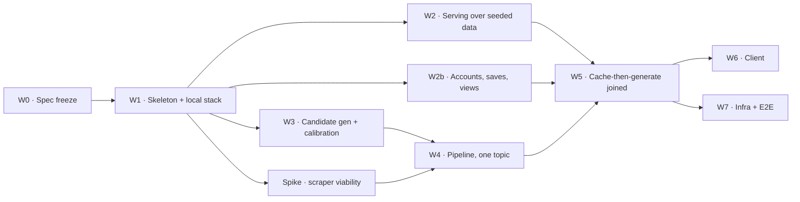

# InstaCram — Implementation Plan

Task-level build order. [BUILD-PLAN.md](BUILD-PLAN.md) §5 remains the authority on *what* each phase delivers and why; this document holds *how*, *in what order*, and *what has to be true before the next thing starts*. Current state is in [FEATURES.md](FEATURES.md); reasoning is in [DECISIONS.md](DECISIONS.md).

Work packages are lettered **W0–W7** and map onto the phases in BUILD-PLAN §5. They are sized to end at something demonstrable, not at a time estimate — no dates appear in this document, because none would be real.

---

## 1. Dependency graph

**Critical path: W0 → W1 → W3 → W4 → W5.** W2 and W2b are off it and can run alongside W3; they are still required before W5 closes.

| Can run in parallel | Why |
|---|---|
| W2 and W2b | The account path is independent of the entire feed path (BUILD-PLAN §2.1) |
| W2/W2b and W3 | W3 touches no serving routes — it is the candidate generator, the embedding call, and a calibration harness |
| The scraper spike and W3 | Different services entirely, and the spike is deliberately throwaway |
| Inside W4: scraper and data-gen agents | No data dependency on each other — this is the parallelism the pipeline design exists to exploit |

---

## 2. W0 — Spec freeze

Closes out phase P0. No code beyond schema and contract files.

| # | Task | Done when | Blocks |
|---|---|---|---|
| ~~0.1~~ | ~~Choose the embedding model~~ | **Decided:** self-hosted sentence-transformers. The *specific* model is chosen by measurement and moves to task 3.6a | — |
| ~~0.2~~ | ~~Choose the streaming transport~~ | **Decided:** paginated HTTP with prefetch; partial page + `generating: true` on a miss; no SSE | — |
| 0.3 | **Schema DDL** — 9 tables | Migration applies to an empty Postgres and rolls back cleanly | W1, W2 |
| 0.4 | **API contract** — endpoints, page shape, `generating` flag, view-logging obligation | Written down; a client could be built against it without asking a question | W2, W5, W6 |
| 0.5 | **Qdrant collection definitions** — both collections | Collection config, distance metric. **Vector size is left open until 3.6a picks the model** | W4 |
| 0.6 | **Agent prompts** — 4 LLM agents + the candidate generator's description format | Drafted; the description one-liner has a fixed length budget and shape | W3, W4 |

### 2.1 Notes that change how these get written

**0.3 — express invariants as constraints wherever the database can carry them.** From BUILD-PLAN §3.2: `UNIQUE(field_id, topic_id)` for invariant 2; `NOT NULL` on `source_url` and `trust_label` for invariant 4; a `CHECK` on `Topic.status`; foreign keys for invariant 8. Invariants 9 (description never rewritten) and 10 (quarantine never served) cannot be expressed in DDL — 9 wants a trigger or a code-level rule, 10 is guaranteed structurally by being a separate table. **Write down which invariants the schema enforces and which rely on discipline**, because the second list is where bugs will come from.

**0.4 — two things in the contract are easy to leave implicit and must not be.** First, **a page may return fewer cards than asked for**, including zero, with `generating: true` alongside — the client's contract is "render what arrived, re-request while the flag is set", not "expect 10". Second, **logging a view is the client's obligation, on display**; the server must not infer an impression from what it sent (P12). Both are invisible until the data is wrong.

**0.5 — the collections cannot be created until 3.6a runs.** Vector size is fixed at creation and differs across the candidate models (384d vs 768d). Everything else about the collections can be written now; the dimension is filled in from the sweep result.

**0.6 — the candidate generator's description format is load-bearing.** It is not prose quality, it is comparability: both sides of every similarity comparison come from this prompt (invariant 9). Fix the length budget and the shape now — "one line, ≤15 words, defines the concept, no examples" — because changing it later invalidates every stored vector *and* the calibrated threshold.

---

## 3. W1 — Skeleton and local stack

Nothing intelligent. The goal is that every later package starts from a running system.

| # | Task | Done when |
|---|---|---|
| 1.1 | Monorepo layout per BUILD-PLAN §6 | Directories exist with placeholder READMEs |
| 1.2 | `docker-compose.yml` — Postgres + Qdrant + both services + LiteLLM gateway | `docker compose up` from a clean clone brings all five up |
| 1.3 | Migration tooling wired, 0.3's DDL applied | Fresh container → schema present; migration is repeatable |
| 1.4 | Express service boots with `/health` | Returns 200, reports DB connectivity |
| 1.5 | FastAPI service boots with `/health` | Same |
| 1.6 | GitHub Actions: lint + test both services on push | Green on a trivial passing test in each |

**Why this is first and not skipped:** the split-service decision's accepted cost was two toolchains. This package is where that cost is actually paid, and paying it on an empty repo is far cheaper than discovering it mid-pipeline. **Done when a clean clone reaches a running stack in one command** — if that is not true at the end of W1, it will not become true later.

---

## 4. W2 — Serving over seeded data

Phase P1. Proves the schema, the junction table and the API shape with **no LLM anywhere in the system.**

| # | Task | Done when |
|---|---|---|
| 2.1 | Seed script: 2 fields, ~6 topics, ~15 scrolls, hand-written | `npm run seed` populates a fresh DB |
| 2.2 | Repository layer over the 11 tables. **Every scroll read goes through `live_scroll`, never `scroll`** (invariant 12) | Unit tests cover each table's reads and writes, plus a test that a retired card never appears in a feed, revision or saves response |
| 2.3 | Feed endpoint returning a page of seeded scrolls in the 0.4 contract shape | A request for a seeded field returns ≤10 cards |
| 2.4 | **The junction-table proof, as an automated test** | Seed one topic linked to two fields; assert both feeds return the *same scroll IDs*, and that the topic row count is 1 |
| 2.5 | Paging by view exclusion | Page 1, mark those viewed, request page 2 → no overlap; repeat until exhausted, then the feed returns empty rather than looping |
| 2.6 | Partial page + `generating` flag | With a field whose topics are seeded `status='pending'`, the endpoint returns what exists plus `generating: true` |
| 2.7 | `exhausted: true` when no unviewed scrolls remain | View every seeded scroll in a field; the next page returns the exhausted signal, not an empty loop |
| 2.8 | Revision mode — viewed scrolls, oldest `viewed_at` first | Returns previously-viewed scrolls in the right order, only when explicitly requested |
| 2.9 | Adjacent fields by shared-topic overlap | Seed two fields sharing 2 topics and one sharing none; the query ranks them correctly |

Tasks 2.7–2.9 are the end-of-field card's server half ([BUILD-PLAN.md](BUILD-PLAN.md) §4.3b). All three are pure query logic over seeded data, so they land here rather than waiting for the client in W6 — and 2.7's test is the guard against the feed ever silently looping.

**2.4 is the point of the whole package.** The central architectural claim — a topic is not owned by the field that created it — becomes a passing test before any AI exists to complicate it. If the schema is wrong, this is where it shows, while the fix is still a migration on seeded data rather than on generated content.

Seed the `empty` case too: one topic with `status = 'empty'` and zero scrolls, so the feed's handling of it (BUILD-PLAN invariant 6) is exercised from the first day rather than discovered in W4.

---

## 5. W2b — Accounts, saves, views

Phase P2. Runs in parallel with W2.

| # | Task | Done when |
|---|---|---|
| 2b.1 | Firebase Auth wired; login/signup | A token round-trips and identifies a user |
| 2b.2 | Saves endpoints over `saved_scroll` | Save, reload, still saved. `GET /v1/saves` returns newest first by `saved_at`, and saving twice is a no-op |
| 2b.3 | Local-storage mirror on the client side of the contract | Specified in 0.4; implemented in W6 |
| 2b.4 | View logging — one `User_View` row per **displayed** card | Fetch a page of 10, display 4, assert exactly 4 rows |
| 2b.5 | `DELETE /v1/account`: `erase_account()` plus deleting the Firebase Auth user | Erase an account that has views and saves: its rows are gone, one `erasure_log` row exists with no identifier, and the Firebase user no longer exists |

**2b.4 is the one that must not slip, and its done-condition is the whole point.** Fetching 10 and displaying 4 must produce 4 rows, not 10 — prefetch makes delivered and seen diverge, and logging the wrong one corrupts the only dataset that cannot be repaired (P7, P12). It is also no longer write-only: W2's paging (2.5) reads it, so a lost write now shows up as a repeated card rather than as a degraded future feature.

---

## 6. W3 — Candidate generation and threshold calibration

Phase P1b. The first LLM in the system, and deliberately the cheapest one.

| # | Task | Done when |
|---|---|---|
| 3.1 | LiteLLM gateway pointed at host Ollama (`qwen3:8b`, fallback `qwen2.5-coder:7b`) | Both services complete a trivial call through it |
| 3.2 | Embedding service container + client | A string round-trips to a vector; the container is in `docker compose` and needs no network at runtime |
| 3.3 | Candidate Topic Generator: field → `[{name, description}]` | Returns ~20 candidates for a field, descriptions within the 0.6 budget, as strict JSON with no reasoning preamble (`qwen3` emits `<think>` blocks by default — disable or strip them) |
| 3.4 | Qdrant write + search against the Topic-Name collection | A written topic is retrievable by similarity |
| 3.5 | **Calibration harness**, parameterised by embedding model | Produces the pairwise similarity matrix for a set of fields, for any given model |
| 3.6 | **Labelled set** | ~50 hand-labelled pairs committed |
| 3.6a | **Model comparison** — run 3.5 across `all-MiniLM-L6-v2`, `bge-base-en-v1.5`, `e5-base-v2` | A table of each model's best achievable threshold and the split rate at it. **Unblocks task 0.5** (vector dimension) |
| 3.7 | **Chosen model + chosen threshold** | Both committed with the sweep that produced them |

### 6.1 How the calibration runs

Per BUILD-PLAN §4.2. Field selection is the part that matters — it must contain the failure the threshold exists to prevent:

- **Deliberate overlap:** *Java Utils* / *Java Collections* / *Data Structures* — should share HashMap, and those pairs should sit above threshold.
- **Deliberate collision:** *Web Development* / *Data Structures & Algorithms* — both yield "Stack", meaning different things. **These pairs must sit below threshold, and this is the constraint that sets the number.**
- **Unrelated control:** *Behavioural Economics* — nothing should match anything.

Sweep, then take the lowest threshold at which false merges = 0, and record the split rate that results.

Run the sweep for each candidate model (3.6a) before picking either the model or the number. The model's entire job is this one separation, so measuring it on this job beats choosing on general benchmark reputation — and it produces an answer to "why this model" that survives being asked why twice.

### 6.2 This is a go/no-go checkpoint

If **no model separates the collision pairs from the overlap pairs** — if "Stack"/"Stack" scores above "HashMap"/"HashMap" for all three — then the P4 deferral is wrong and disambiguation has to come forward into v1 rather than waiting for production data. Self-hosted models are weaker on exactly this, so this outcome is more likely than it would have been with a hosted model, and finding out here is the reason the checkpoint exists. That is a real possible outcome, it is cheap to discover here, and it is much more expensive to discover after W4 and W5 are built on the assumption.

**Record the result in DECISIONS.md either way.** A calibration that succeeds validates a deferral; one that fails reverses it. Both are decisions.

**Also note:** the threshold is a property *of the embedding model*. Changing the model invalidates the number and every stored vector together — `reindex` and recalibrate are a pair, never one alone.

---

## 7. Spike — scraper viability

Throwaway, timeboxed, runs alongside W3. Not a work package that ships.

**The question:** can Playwright actually retrieve usable grounding material for 10 real topics across 2 fields, or do the useful sources block it?

This is the highest-uncertainty component in the system and the plan currently buries it inside W4, where it would surface late. The scraper is also the only non-LLM agent, so there is no prompt-tuning escape hatch if sources are hostile.

**Done when** there is an answer and a number: how many of 10 topics yielded usable material, and from what kinds of source. If the answer is poor, the fallback options are real and should be chosen here rather than improvised: lean harder on the LLM data-generation agent with the scrape as optional enrichment, or narrow v1 to fields with reliably scrapable sources, or use a search API rather than direct scraping. **Also settle robots.txt and terms-of-service handling here** — it is on the open items list and this is the moment it becomes concrete.

**DONE, 2026-09-15 — and it answered a question it was not asked.** Retrieval: **10/10 usable** over plain HTTP, median 22,816 chars in 1.1s, so **Playwright is not needed for this source** and the browser question is settled. Relevance: **much worse.** Four Java topics (*TreeSet*, *ArrayList*, *ConcurrentSkipListMap*, *LinkedHashMap*) matched one identical article at 22,789 chars each, and *HashMap* matched *Hash table*; all 5 Behavioural Economics topics matched well. Direct title lookups confirmed the cause is not query tuning — three of those classes have **no Wikipedia article at all**, and two redirect to general CS concepts. This inverts the spike's own hypothesis that non-technical sourcing would be the thin side. The three chosen fixes land in 8a below, and the mismatch record is migration `007`. See P26.

---

## 8. W4 — The pipeline, one topic end to end

Phase P3. The largest package; split internally so it does not become one long unverifiable stretch.

### 8a — Agents standalone

| # | Task | Done when |
|---|---|---|
| 4a.1 | Web Scraping Agent | **DONE.** `app/agents/scraper.py` + `app/sources/`. Runs standalone via `scripts/run_scraper.py`: 5/10 grounded with source URLs, 5/10 explicitly refused |
| 4a.1b | **Relevance check**: compare the returned article title against the requested topic | **DONE.** `app/relevance.py` — directional token containment, deterministic, no threshold to calibrate. All 6 measured mismatches rejected, all 4 measured matches kept. A rejection writes `unsourced_topic` and the topic is refused, never grounded on the wrong article (P26). Known limitation, asserted by a `strict` xfail: an abbreviation shares no tokens with its expansion |
| 4a.1c | **Second source** for topics an encyclopedia lacks at class granularity | **DONE.** `app/sources/javadoc.py`. All four Java classes now return their own class page — *Java Collections* went 1/5 → 5/5, overall 10/10. Discovery is deterministic (class → package → module → one URL), so P26's wrong-article failure cannot occur on this source. `robots.txt` checked: the API docs are permitted. Beware the **soft 404** — the module-less URL answers 200 with the JDK home page (P28) |
| 4a.1d | **Section-level extraction** when several topics share one article | **DONE.** *LinkedHashMap* grounds on its own **424-char section** rather than the 22,789-char page, and degrades to 4a.1b's refusal when no section matches. Section headings use the **strict sibling rule**: they are peers chosen for similarity, so containment would accept *LinkedHashMap* for *HashMap* — and did, until P27 |
| 4a.2 | LLM Data-Generation Agent | **DONE.** `app/agents/data_gen.py`. Returns content + self-reported confidence; anything not exactly `high` is treated as low, so an invented third value cannot read as confident |
| 4a.3 | Card Generation LLM | **DONE.** `app/agents/card_gen.py`. 4 drafts, 0 malformed on the first run. Validates every field in the agent rather than at the database, and **rejects a `source_url` the generator invented** — a fabricated link looks like provenance, and that link is the user's only way to check a fact (invariant 4) |
| 4a.4 | Fact-Check Agent | **DONE.** `app/agents/fact_check.py`. 4/4 pass at ~7.5s each, each with a specific reason. An unrecognised verdict **raises rather than defaulting to fail** — needed on the very first run, when a prompt bug (P29) would otherwise have quarantined every card and marked the topic `empty` |

Each is independently runnable and independently tested before any graph exists. 4a.1 and 4a.2 have no dependency on each other by design.

**8a is COMPLETE.** `scripts/run_agents.py` runs all four for one topic: scraper + data-gen concurrently in 37s, card generation 4 drafts in 63s, fact-check 4/4 pass at ~7.5s each — roughly **130s per topic** on a local `qwen3:8b`. That is the first cost-per-topic figure, and 8d turns it into a measurement across many topics.

### 8b — Graph wiring

| # | Task | Done when |
|---|---|---|
| 4b.1 | LangGraph definition of the 5 steps with the fact-check branch | **DONE.** `app/graph/pipeline.py`, run by `scripts/run_pipeline.py`: `HashMap` → `ready`, 4 drafts, 4 passed, 121.9s. Four outcomes are kept distinguishable — `ready`, `unsourced`, `empty`, `degraded` — because "no cards" has three different causes and only one of them is the topic's fault |
| 4b.2 | Scraper and data-gen execute **concurrently** | **DONE.** Two edges out of `START`. Asserted in `tests/test_graph.py` with 50 ms stubs: sequential would take ≥100 ms, the graph finishes under 90 ms. Measured live at 37s for the pair |
| — | **A `join` node that does nothing** | Load-bearing despite being a no-op. LangGraph fires a node when **any** inbound edge fires, so the conditional had to sit after both branches meet or `data_gen` alone would trigger card generation for an ungrounded topic (P30) |

### 8c — Persistence, observability, consistency

Ships **with** the pipeline, not after it (BUILD-PLAN §4.3).

| # | Task | Done when |
|---|---|---|
| 4c.1 | Pass → persist scroll, embed into Scroll-Content collection, set `status='ready'` | **DONE.** 4 cards persisted and read back; `reindex` writes the Scroll-Content vectors (12 on the seeded corpus) |
| 4c.2 | Fail → `Rejected_Draft` row with reason; counters increment; cap at last 20 per topic | **DONE.** Written in the same transaction as the cards, so counters can never disagree with what was persisted. Verified `generated 4 / passed 4 / failed 0 / runs 1`. **A checker that errored is not counted as a rejection** |
| 4c.3 | All-fail → `status='empty'`, `runs` incremented | **DONE.** Covered by graph tests with a stubbed rejecting checker; the `degraded` path is deliberately kept separate and leaves the topic `pending` |
| 4c.4 | Outbox: topic + outbox row in one transaction | **DONE.** `create_topic_with_outbox`. Note what it does *not* do: no embed, no Qdrant write — a network call inside the transaction that must not fail is exactly what the outbox exists to avoid |
| 4c.5 | Outbox worker drains to Qdrant with bounded retry/backoff, then dead-letters | **DONE, proved against the real stack.** Qdrant killed mid-drain: row retried with its error recorded, worker survived; restarted, vector appeared, row `done`. 5 attempts / exponential backoff / dead-letter. **A third failure the plan did not name is also handled**: a worker dying mid-row strands it in `processing` forever, so a reaper returns stale rows to the queue |
| 4c.6 | Reconciliation check, both directions, **and re-enqueue of dead-lettered rows** | **DONE.** Both directions verified, with opposite treatment — missing vector re-enqueued (waste), orphan vector deleted (corruption). A dead-lettered row was revived and its vector came back |
| 4c.7 | `reindex` rebuilds both collections from Postgres | **DONE.** Collection dropped, rebuilt: 8 topic + 12 scroll vectors, search working (top score 0.7609). Reads `live_scroll`, so retired cards do not reappear via semantic search |
| 4c.8 | Prometheus counters for drafts generated/passed/failed | **DONE.** `app/metrics.py`, served at `GET /metrics` on the pipeline and verified from the rebuilt container. Rejections and **checker errors are separate counters**, never summed — they look identical in one number and need opposite responses. Outcomes are labelled (`ready`/`unsourced`/`empty`/`degraded`) rather than collapsed into a failure count. Duration buckets go to 600s, because the default buckets top out at 10s and would file every run of a ~120s local model in `+Inf` |

**4c.5 and 4c.7 are the tests worth writing carefully.** They are the only evidence that P11's resolution actually holds, and both are trivial to run now and awkward to retrofit.

### 8d — Measure, then decide

The first real pipeline runs produce the project's first numbers. Record them in FEATURES.md §4:

- fact-check rejection rate
- topics yielding zero surviving cards
- wall-clock per topic, and the concurrency saving from 4b.2
- **cost per topic** — now that the model runs locally (Ollama), this is wall-clock time and tokens rather than money. It still decides whether the cache hit rate is a nice property or the thing the product depends on, because a slow local model makes a cache miss painful rather than expensive
- **fact-check quality with thinking on vs off** — run one sample of drafts both ways and compare each verdict against your own judgement, using the quarantined text. This settles the question deferred on 2026-09-12; W4 is the first point where it can be measured instead of guessed

If the rejection rate is high, that is the evidence the no-retry decision was deliberately left open for (P10). Decide then, with the quarantined text in hand.

**8d is COMPLETE, and the first run of it was misleading in a way worth recording.** Measured over 6 topics (`measurements/20260916-061312.json`): 6/6 `ready`, 24 drafts attempted, **4 malformed (17%, three of them on TreeSet alone)**, 20 valid, **median 113s per topic** (min 92, max 128), 11.3 min total. The headline rejection rate was **0.000** — and that number turned out to mean nothing, because the gate had never been shown 11 of the 20 cards (P33). A rate of zero is what a working gate and a blind gate both report.

So 8d gained a step it did not originally have, and every later measurement depends on it: **`scripts/negative_control.py` must pass before a rejection rate is quoted.** It plants known-false claims in cards built on real grounding and checks the gate catches them, with faithful controls that must still pass. Current state: **7/7 planted errors caught, 2/2 controls kept**, across both the single-pass and chunked paths.

What the numbers now say:
- **rejection rate** — 0/9 on the drafts that were genuinely checked. Too small a sample to settle P10, and it must be re-measured now the gate works. The no-retry decision stays open.
- **zero-card topics** — 0 of 6.
- **cost per topic** — 113s median, and this is the number W5 is built against: a cache miss is ~2 minutes of waiting. Chunking raises it for long sources: a *passing* card on a 32k-char source spends 11 fact-check calls / 132s, because passing means ruling out a contradiction in every excerpt. Rejection is usually much cheaper — it short-circuits at the first contradicting excerpt, seen at 17s.
- **thinking on vs off** — settled: **off**. See DECISIONS 2026-09-16. The A/B as originally specified could not have answered it, because it compared arms on drafts that all passed; it had to be re-asked on cases that discriminate.

---

## 9. W5 — Cache-then-generate, joined up

Phase P4. Proves the central claim of the architecture.

| # | Task | Done when |
|---|---|---|
| 5.1 | Feed Orchestrator: candidates → lookup → branch | A field request reaches either reuse or trigger |
| 5.2 | Empty topics are reported in `failed_topics` and never retried by paging or polling | Test: poll a field containing an empty topic 20 times and assert **zero** pipeline runs for it (P16) |
| 5.3 | Reuse path: write `Field_Topic`, fetch scrolls, stream | Second field surfaces existing content |
| 5.4 | Miss path: trigger pipeline async, stream cards as they pass | Cards arrive progressively, not in one batch |
| 5.5 | **The reuse proof, as an automated test** | Request field A; request overlapping field B; assert pipeline invocations for the shared topic = **0**, exactly one new `Field_Topic` row, and identical scroll IDs served under both |
| 5.6 | Topic expansion: candidate generator re-run with existing names as exclusions, plus re-queue of the field's failed topics | Tapping "more topics" yields names not already linked to the field, and sends its empty topics for another run (`failed_retried` > 0) (P17) |
| 5.7 | Adjacent-field LLM fallback when overlap is thin | A field with no shared topics still returns suggestions, flagged as having no existing content |

**5.5 is the acceptance test for the entire design.** Everything upstream exists to make that assertion pass. Write it as a test rather than a demo, because it is also the regression guard for every later change to the lookup.

Measure and record: cache hit rate on candidate topics, time-to-first-card on a hit versus a miss. **Take the hit rate on generator-created topics only** — topics written by `seed.ts` or the pipeline scripts have hand-authored descriptions the generator's candidates mostly cannot match, so a hit rate read off a database containing them measures the database, not the cache (P36).

**W5 progress (2026-09-16):**

| # | State | Evidence |
|---|---|---|
| 3.4 | **Done** | `npm run vectors:verify` against the real index: 14/14 topics retrieve themselves at 1.0000; an unrelated query peaks at 0.7923; 0 orphans |
| 5.1 | **Done** | A first request enqueues an expansion and returns in **224ms**; the worker generates and resolves candidates. Live: `Java Data Structures`, 20 candidates → 1 reused / 19 created, 0 errors, 54.4s |
| 5.2 | **Done** | The plan's own test, verbatim: 20 polls of a field holding an empty topic, zero requeues. **Seen failing** when a poll was made to requeue empty topics |
| 5.3 | **Done, live** | `Java Data Structures` served 2 reused `TreeSet` cards at t+0, before any generation. No automated end-to-end test yet — that is 5.5 |
| 5.4 | **Done, live** | Serving creates the pending topic; the pipeline's topic worker claims and generates it. Cards arrived **per topic** (2 → 5 at t+50s) with `generating` true throughout. Claim exclusivity, dead-worker recovery and degraded-run backoff each **seen failing** with their mechanism removed. Building it exposed **P37**: the outbox worker had never run in the deployed service |
| 5.5 | **Done** | `tests/reuse.test.ts`, through the real HTTP feed, expansion queue, resolver and Postgres (LLM, Qdrant and the Python pipeline stood in for). Field A then overlapping field B: the shared topic is generated **once**, gains **exactly one** new `Field_Topic` row, and serves **identical scroll IDs** under both. Seen failing with reuse disabled — and that control exposed a weak assertion: "generated once" first counted only the original row's id, which broken reuse never regenerates (it makes a *second* row), so it now counts every row of the shared topic. Proves the mechanism, not the hit rate (P36) |
| 5.6 | **Done** | `POST /v1/fields/{id}/expand` returns `202` at once, re-queues the field's failed topics, and queues a `more` expansion whose candidates exclude the field's existing topics. Its result reaches the feed as `last_expansion`; the API contract changed to say so. Exhaustion signal, no-stacking, exclusions and 404-on-malformed-id each **seen failing** with their mechanism removed. Fixed on the way: a malformed field id returned `500` on `/adjacent` too |
| 5.7 | **Done** | A field with no shared topics still gets suggestions on its end card, flagged `has_content: false` — the plan's test, verbatim. Suggestions are generated in the background after an expansion and stored; overlap fields come first and suggestions fill the free slots. Seen failing with `has_content` hardcoded and with regeneration unguarded. Live: *Java Data Structures* → 1 overlap field + 4 suggestions, the model's duplicate of the overlap field dropped, and *Java Streams* correctly reported as having content |

Decisions taken to get here, each recorded in DECISIONS.md on 2026-09-16: Postgres as the queue for both the pipeline and candidate generation; an advisory lock on the candidate name **plus** a Postgres read for topics whose vector is still owed (the lock alone was shown to prevent nothing, P35); deterministic tie-breaking between duplicate topics, without which 5.5 could fail while every lookup looked correct.

---

## 10. W6 and W7

**W6 — Client (phase P5).** *Started 2026-09-17: one Expo codebase for web, iOS and Android (`clients/app`), with a server-checked developer login. First slice verified in real Chrome — login, wrong-password refusal, home, a feed card with all five elements, reveal, save, and a view logged only after the card stayed on screen. Not yet done: the local-storage mirror (2b.3), native builds run on a device, and Google sign-in.* Delivers the feed UI plus the five MVP card elements (source link, trust label, tap-to-reveal recall prompt, "why this matters", bookmark) and the local-storage mirror from 2b.3. Also the two states the server halves were built for in W2 and W5: the **end-of-field card** with its three actions, and the **cold-start waiting state** — rendered only once partial cards are exhausted, carrying the ready-count rather than a bare spinner. Overlap-based and LLM-suggested adjacent fields must be visually distinguishable, since tapping the latter lands in a cold start.

**W7 — Infrastructure (phase P6).** K8s manifests identical for `kind` and GKE, Prometheus scraping both services, Grafana with serving latency and pipeline throughput on separate panels, Playwright/Selenium E2E covering field request → feed render → bookmark → reload. Re-check the GKE/EKS pricing figures before the GKE deploy, per the open item. **Database roles:** run the serving service under a role without direct `DELETE` on `account` and `user_view`, and make `erase_account()` `SECURITY DEFINER`. Until then, the erasure rules guard against mistakes, not against a compromised application (P21).

---

## 11. Checkpoints where the documentation gets updated

Not a ceremony — these are the four moments where something is learned that cannot be recovered later:

| After | Update | What gets recorded |
|---|---|---|
| W3.7 | DECISIONS.md + FEATURES.md | The chosen model, the threshold, the comparison table, and whether the P4 deferral survived §6.2 |
| Spike | DECISIONS.md | Scraper viability, the fallback chosen if any, robots.txt/ToS policy |
| W4.8d | FEATURES.md §4 | First real numbers, including cost per topic; DECISIONS.md if no-retry is revisited |
| W5.5 | FEATURES.md | Cache hit rate and time-to-first-card; the first `Done` statuses in the file |

---

## 12. Start here

W0, W1, W2, W2b, W3, the scraper spike, and **all of W4 (8a, 8b, 8c, 8d)** are done. Task 0.5 is closed — both Qdrant collections exist at 768 dims / Cosine. One carve-out remains: task 2b.1 (Firebase verification) waits on credentials, with auth running as a dev stub until then.

**W3's result:** `intfloat/e5-base-v2` at threshold `0.955`, and the §6.2 go/no-go **passed** — strict-threshold-only matching is viable, at a measured cost of roughly a third of identical topics regenerating as duplicates. Task 3.4 (the Qdrant write + search path) is carried into W4.

**W4 is complete.** One topic goes scrape → generate → write → fact-check → persist → vectorise, at a **113s median** over six measured topics. Sourcing reaches **10/10 on the benchmark**, after three fixes that had to ship together — a relevance check, multi-candidate discovery, and a Javadoc source for what Wikipedia has no page for. The quality gate is verified by a negative control at **7/7 planted errors caught, 2/2 controls kept**, after P33 showed it had been passing long-source cards it was never shown. The LangGraph tripwire fired at W4's end and **resolved as keep** — three conditional edges and four terminal outcomes, against the one branch that set the tripwire. Task 3.4 is still open and is now W5's first job.

Next:

1. **W5 — cache-then-generate wiring, in progress.** 3.4 and all of 5.1–5.7 are done, including the acceptance test for the whole design (see the progress table in §9). **What remains of W5 is measurement:** the W5 measurements — cache hit rate on a clean database, and time-to-first-card on a hit versus a miss.
2. **Re-measure the rejection rate** once a batch has run through the fixed gate. The 8d figure is `0/9` on the drafts that were genuinely checked — too small to settle P10, and the earlier `0.000 over 20` is withdrawn. Run `scripts/negative_control.py` first, every time, before quoting a rate: it is the only thing that distinguishes a gate that passes everything from a gate that has nothing to reject.
3. **W6 (client)** stays blocked on the framework choice, and nothing before it depends on one.

**The 113s median is the number W5 is designed against.** A cache miss is roughly two minutes of waiting, which is what makes the cache hit rate the thing the product depends on rather than a nice property — and why `generating` has to be a first-class response rather than an error.
