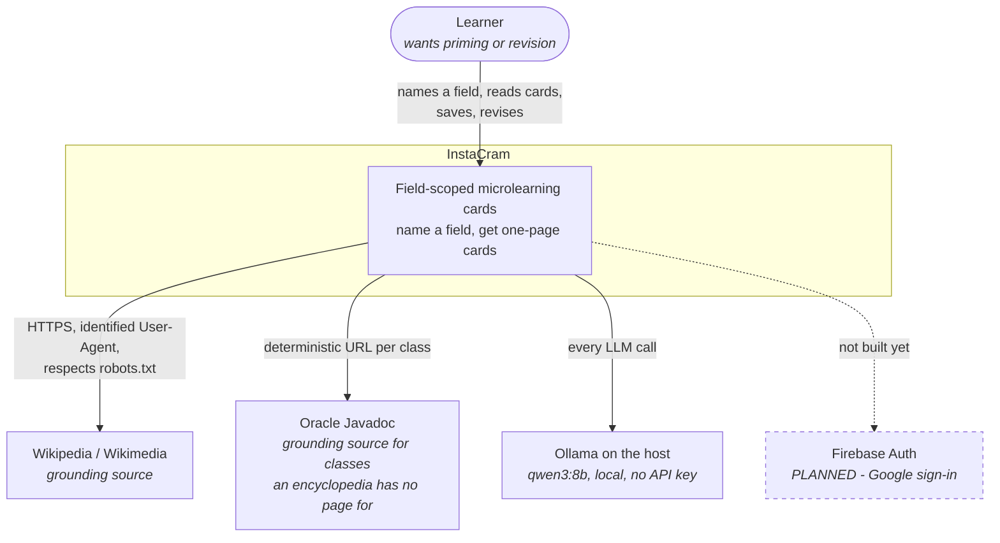
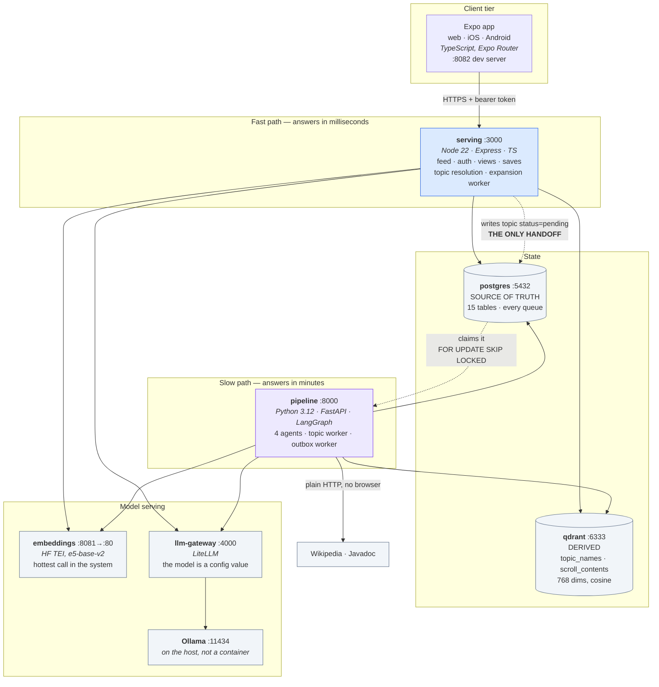
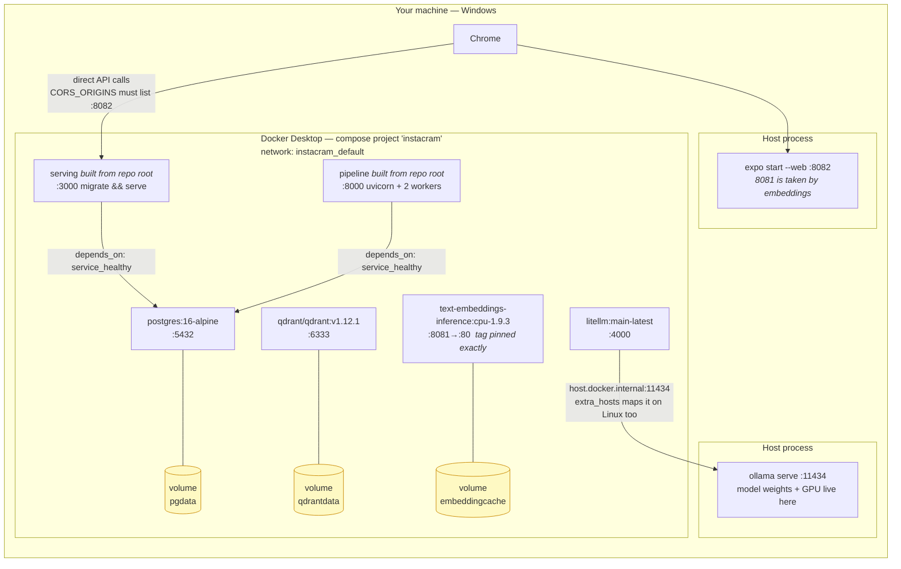

# 01 — High-level design

Three zoom levels: the system in its world, the pieces inside it, and where those pieces physically run.

---

## 1.1 Context — the system and everything outside it

**What to notice.** Every external dependency except the two sources is *local*. There is no cloud LLM, no managed vector service, no third-party analytics. The cost of a generated card is electricity, and the system can run with the network off once a model is pulled — which is why measuring cost per topic was possible at all.

The scraper identifies itself honestly. That is a rule, not an accident: Wikimedia answers `403` without a contact in the User-Agent, and the pipeline's topic worker **refuses to start** rather than scraping anonymously.

---

## 1.2 Containers — what runs, and what each one owns

**What to notice.**

1. **No arrow between serving and pipeline.** The dashed pair through Postgres is the entire integration. Either service can be restarted, rebuilt or broken without the other losing a job.
2. **Both services talk to the same four things**, and both must agree on two settings — the embedded text prefix and the match threshold. If they disagree, vectors written by one will never match vectors searched by the other, silently. That is why `docker-compose.yml` forwards those variables into both containers explicitly.
3. **Qdrant is derived.** Delete it and `reindex` rebuilds it from Postgres. The reverse is not true, and nothing is designed as though it were.
4. **Embeddings bypass the LLM gateway.** One is a hot, high-volume, small-model call; the other is a slow, low-volume, large-model call. Routing both through one gateway would put the hot path behind the slow one's queue.

---

## 1.3 Deployment — where it physically runs today

**What to notice.**

- **Two processes are not containers**, and both are easy to forget: Ollama (weights and GPU are on the host) and the Expo dev server. If generation silently never happens, Ollama is the first thing to check — the gateway's health endpoint returns `200` regardless.
- **The browser calls the API directly**, not through the Expo server. So the API's CORS list, not the dev server, decides whether the app works.
- **Three named volumes hold everything you would miss:** the database, the vectors, and the cached embedding model (a 289–329s download). `docker compose down` keeps them. `docker compose down -v` destroys all three.
- **Only Postgres has a healthcheck others wait on.** Qdrant, embeddings and the gateway are used lazily; a call that arrives before they are ready fails and is retried rather than blocking startup.
- **Nothing here is deployed anywhere.** K8s manifests, Prometheus, Grafana and a real ingress are W7. The `/metrics` endpoint exists; nothing scrapes it.
