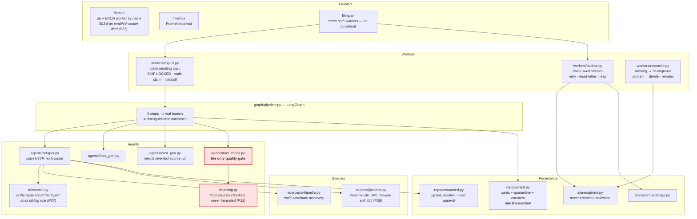
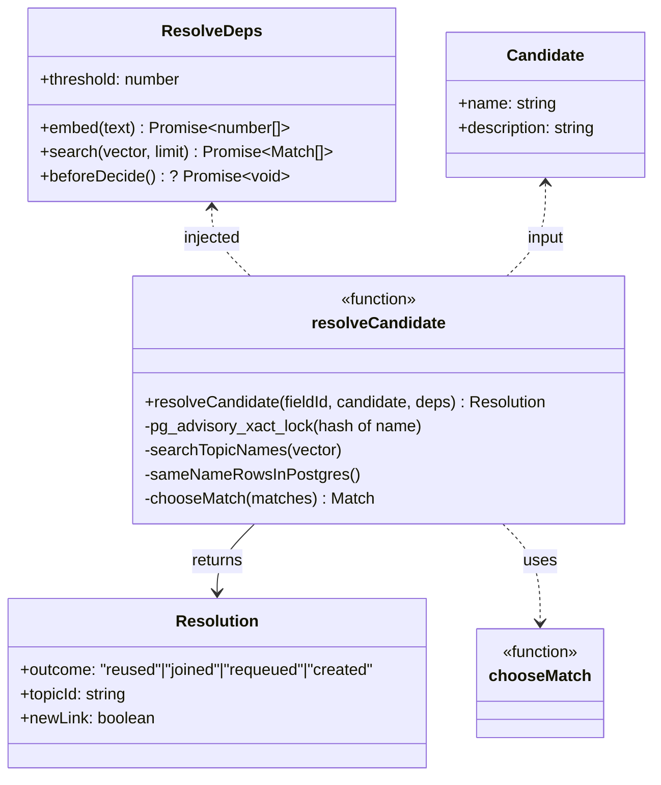
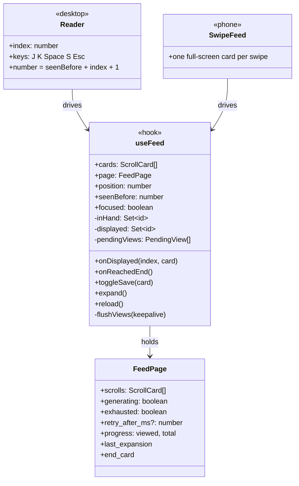

# 02 — Low-level design

Inside each service: the modules, who calls whom, and the objects that carry the design.

---

## 2.1 Components — serving

```mermaid
flowchart TB
    subgraph http["HTTP layer"]
        cors["cors.ts<br/><i>listed origins only</i>"]
        authmw["auth.ts<br/>requireAccount<br/><i>dev · dev-login · firebase(501)</i>"]
        rauth["routes/auth.ts<br/>POST /v1/auth/login"]
        rfeed["routes/feed.ts<br/>POST /feed · /feed/revision<br/>POST /fields/:id/expand<br/>GET /fields/:id/adjacent"]
        racct["routes/account.ts<br/>POST /views · GET /saves<br/>PUT|DELETE /saves/:id<br/>DELETE /account"]
    end

    subgraph domain["Domain"]
        feedsvc["feed/feedService.ts<br/>page assembly:<br/>generating · exhausted · end card · progress"]
        resolve["topics/resolve.ts<br/><b>the branch point</b><br/>reused | joined | requeued | created"]
        cand["topics/candidates.ts<br/>LLM: field → candidates"]
        adj["topics/adjacent.ts<br/>LLM: related fields"]
        etext["topics/embeddingText.ts<br/><i>the ONE place the embedded<br/>string is built — cross-service contract</i>"]
    end

    subgraph work["Background"]
        equeue["expansion/queue.ts<br/>the field_expansion job table<br/>claim · reap · complete · fail"]
        eworker["expansion/worker.ts<br/>claim → candidates → resolve each"]
    end

    subgraph repo["Persistence"]
        rfields["repo/fields.ts"]
        rfeedr["repo/feed.ts<br/><i>every read via live_scroll</i>"]
        raccts["repo/accounts.ts"]
        pool["db/pool.ts · db/migrate.ts"]
    end

    subgraph out["Outbound"]
        embc["embeddings/client.ts<br/>batched, 32 at a time"]
        llmc["llm/client.ts<br/>JSON mode + control-char repair"]
        vidx["vectors/topicIndex.ts<br/><i>search only</i>"]
    end

    rauth --> authmw
    rfeed --> authmw
    racct --> authmw
    cors --> rauth
    rfeed --> feedsvc
    racct --> raccts
    feedsvc --> rfeedr
    feedsvc --> rfields
    feedsvc --> equeue
    eworker --> equeue
    eworker --> cand
    eworker --> resolve
    eworker --> adj
    resolve --> etext
    resolve --> embc
    resolve --> vidx
    resolve --> pool
    cand --> llmc
    adj --> llmc
    rfeedr --> pool
    rfields --> pool
    raccts --> pool

    classDef key fill:#dbeafe,stroke:#2563eb,stroke-width:2px
    class resolve,etext key
```

**What to notice.**

- **The candidate generator lives here, not in the pipeline.** It runs on *every* field request, including pure cache hits where no generation happens at all. Putting it in the pipeline would mean waking the slow half to answer a fast question.
- **`embeddingText.ts` is a contract, not a helper.** The pipeline builds the same string in its own `embedding_text.py`. If the two ever disagree, nothing errors — the cache just stops finding things.
- **`repo/feed.ts` reads only `live_scroll`.** Making the safe query the default one is the whole point of that view: a retired card cannot reach a user through a query someone forgot to filter.
- **The expansion worker runs inside serving**, not as a separate process. It is I/O-bound (LLM + embeddings), so it costs the request path almost nothing, and it keeps deployment to two services.

---

## 2.2 Components — pipeline

**What to notice.**

- **`lifespan` is where P37 was.** Both workers used to exist and never start. They now start by default — a default of *off* would recreate the bug the first time someone deployed without the variable — and `/health` reports each by name.
- **The fact-checker is the only gate**, so it is the only component whose failure mode is *looking perfect*. Hence `chunking.py` beside it and `scripts/negative_control.py` outside it.
- **`stores/qdrant.py` never creates a collection.** Creation is an explicit, separate act (`npm run vectors:ensure`), because a service that silently creates a collection with the wrong vector size turns a loud failure into a silent one.
- **`persist.py` writes cards, quarantine rows and counters in one transaction**, so the counters can never disagree with what was stored.

---

## 2.3 Class — topic resolution, the branch the product rests on

**What to notice.** Three defences sit in one small function, and each was **seen failing with its mechanism removed** (P35):

| Defence | Without it |
|---|---|
| Advisory lock on the candidate name | 8 simultaneous requests create 8 topics |
| Same-name read from Postgres | 8 duplicates *again* — Qdrant cannot see a topic whose vector the outbox has not written yet |
| `chooseMatch` deterministic ordering | Two fields link different copies of the same topic, and the reuse guarantee quietly stops holding |

`beforeDecide` exists only so a test can force eight requests to interleave *inside* the lock. Concurrency that depends on the scheduler being kind is not a test.

---

## 2.4 Class — the client's feed state

**What to notice.** Two rules of the API contract live in this one hook, and both corrupt data silently when broken: **log a view on display, never on fetch** (prefetch means the app holds cards nobody has seen), and **poll at `retry_after_ms`**, the server's cadence, not a constant.

Three fields exist because of P38. `focused` — an unfocused feed logs nothing, because a stack navigator keeps screens mounted after you leave them and they kept logging cards nobody saw. `flushViews(keepalive)` — a browser refresh runs no unmount, so buffered views died with the page. `seenBefore` — numbering continues across visits instead of restarting at 1.
