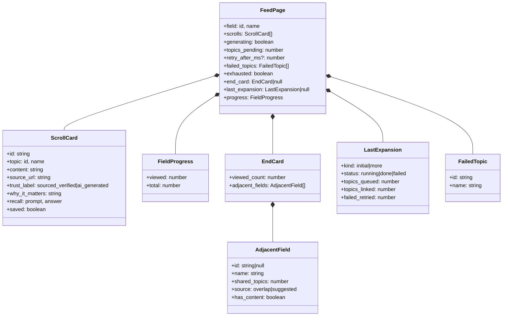

# 03 — Data model

15 tables, one view, 12 forward-only migrations. What is stored, how it relates, and what crosses the wire.

---

## 3.1 Entity relationships

```mermaid
erDiagram
    field ||--o{ field_topic : "links"
    topic ||--o{ field_topic : "linked from"
    topic ||--o{ scroll : "produces"
    topic ||--o{ rejected_draft : "quarantines"
    topic ||--|| topic_generation_stats : "counts"
    topic ||--o{ outbox : "owes a vector"
    scroll ||--o{ user_view : "was displayed as"
    scroll ||--o{ saved_scroll : "saved as"
    account ||--o{ user_view : "viewed"
    account ||--o{ saved_scroll : "saved"
    field ||--o{ field_expansion : "job per request"
    field ||--o{ field_suggestion : "stored LLM suggestions"

    field {
        uuid id PK
        text name
        text name_norm "GENERATED lower(btrim(name)) - UNIQUE"
        timestamptz suggestions_at "when suggestions were last generated"
    }

    topic {
        uuid id PK
        text name
        text name_norm "GENERATED - NOT unique, duplicates are legal"
        text description "written ONCE, never rewritten (trigger)"
        text status "pending | ready | empty"
        timestamptz claimed_at "the claim IS the job lease, and the backoff"
    }

    field_topic {
        uuid field_id FK
        uuid topic_id FK
        timestamptz created_at
    }

    scroll {
        uuid id PK
        uuid topic_id FK
        text content
        text source_url
        text trust_label "sourced_verified | ai_generated"
        text why_it_matters
        text recall_prompt
        text recall_answer
        timestamptz retired_at "retire, never delete (trigger blocks delete)"
    }

    user_view {
        bigserial id PK
        uuid user_id FK
        uuid scroll_id FK
        timestamptz viewed_at "APPEND ONLY - update and delete blocked"
    }

    saved_scroll {
        uuid account_id FK
        uuid scroll_id FK
        timestamptz saved_at
    }

    account {
        uuid id PK
        text firebase_uid "UNIQUE - dev logins namespaced 'dev:'"
        text email
    }

    rejected_draft {
        uuid id PK
        uuid topic_id FK
        text content
        text reason "the checker's own words - the only thing separating a strict gate from a bad generator"
        timestamptz rejected_at "capped at 20 per topic, by trigger"
    }

    topic_generation_stats {
        uuid topic_id PK
        integer drafts_generated
        integer drafts_passed
        integer drafts_failed
        integer runs "runs > 1 means it came back empty and was retried"
    }

    outbox {
        bigserial id PK
        uuid topic_id FK
        jsonb payload
        text status "pending | processing | done | failed"
        integer attempts
        text last_error
        timestamptz next_attempt_at "backoff"
        timestamptz processed_at
    }

    field_expansion {
        bigserial id PK
        uuid field_id FK
        text kind "initial | more"
        text status "pending | running | done | failed"
        integer attempts
        timestamptz claimed_at
        integer candidates
        integer reused
        integer joined
        integer requeued
        integer created
        integer linked_existing
        integer failed_retried
        integer resolve_errors
    }

    field_suggestion {
        uuid field_id FK
        text name
        integer position
    }

    unsourced_topic {
        bigserial id PK
        text topic_name
        text field_name
        text source
        text matched_title
        text kind "no_article | generic"
        integer times_detected "deduped, never appended per run"
        timestamptz resolved_at "resolved, not deleted, when a source succeeds"
    }

    erasure_log {
        bigserial id PK
        integer views_removed "counts only - NO identifier"
        integer saves_removed
    }
```

Plus `schema_migrations` (the runner's bookkeeping) and the `live_scroll` **view** — `scroll WHERE retired_at IS NULL`, which every read path goes through.

### The five decisions this schema encodes

| In the schema | The decision |
|---|---|
| `field_topic` as a junction, `topic.name_norm` **not** unique | A topic is not owned by a field, and duplicates are *legal*. The system prefers a wasted duplicate to a wrong merge. |
| `topic.status = 'empty'` | A topic whose drafts all failed must be representable, or the cache re-serves it as a success forever. |
| `scroll.retired_at` + `live_scroll` | A bad card disappears from every read while its view history survives. Deleting it would break the history. |
| `user_view` append-only, by trigger | It is the paging position *and* the only dataset that cannot be rebuilt. A convention would not be enough. |
| `erasure_log` with counts and no identifier | Proving an erasure happened must not re-create the data it erased. |

### Invariants enforced by the database, not by code

Triggers block: updating or deleting a `user_view`; deleting a `scroll` anyone has viewed; rewriting a `topic.description`; deleting an `account` outside `erase_account()`. `src/db/verify-invariants.sql` tries to break each one and prints 22 PASS/FAIL checks inside a transaction it rolls back.

---

## 3.2 What crosses the wire

**Three states the client must keep apart**, and must never collapse into "loading":

| `scrolls` | `generating` | `exhausted` | Means |
|---|---|---|---|
| non-empty | false | false | a normal page |
| partial or empty | true | false | cold start — keep polling at `retry_after_ms` |
| empty | false | true | the field is finished — render the end card |

The full contract, including error shapes, is [API-CONTRACT.md](../API-CONTRACT.md).
