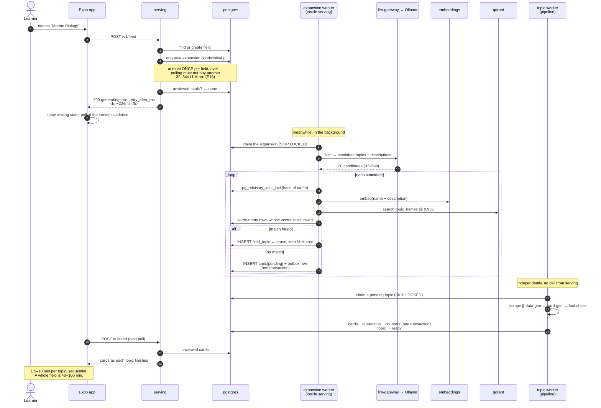
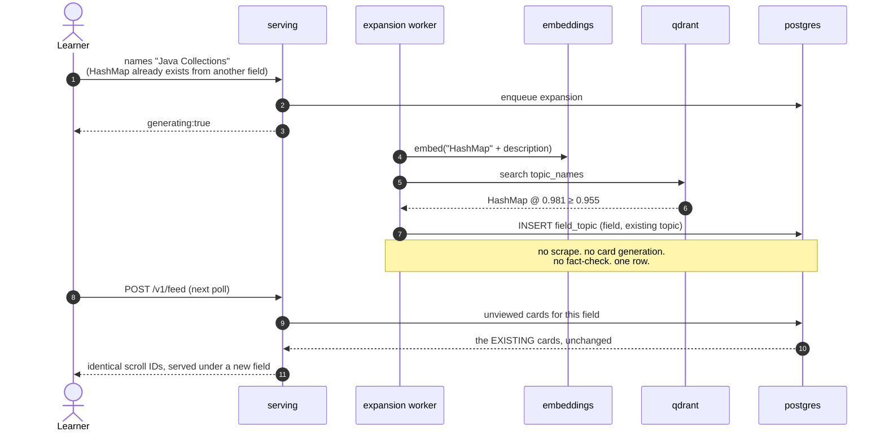
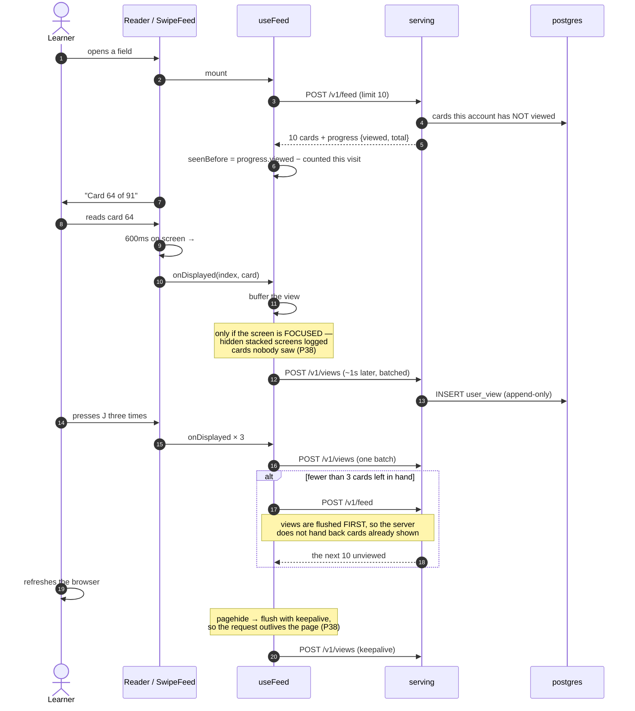
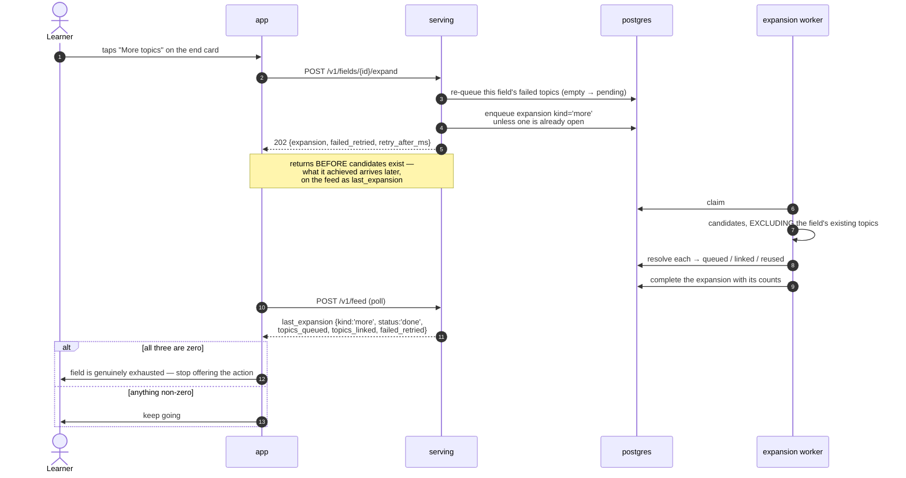
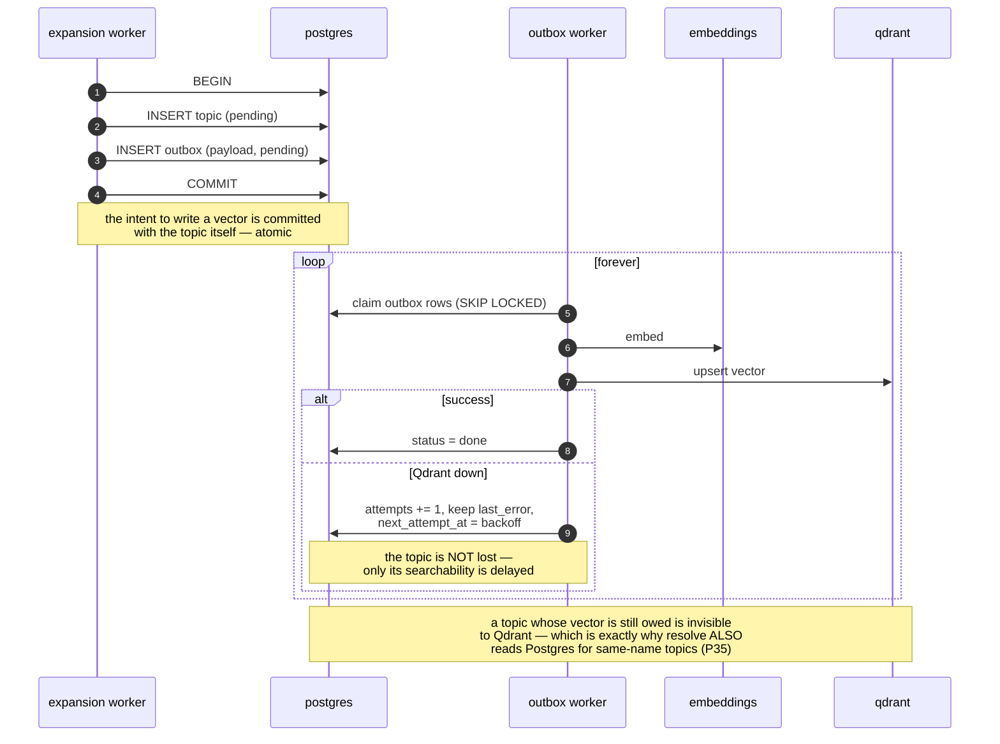
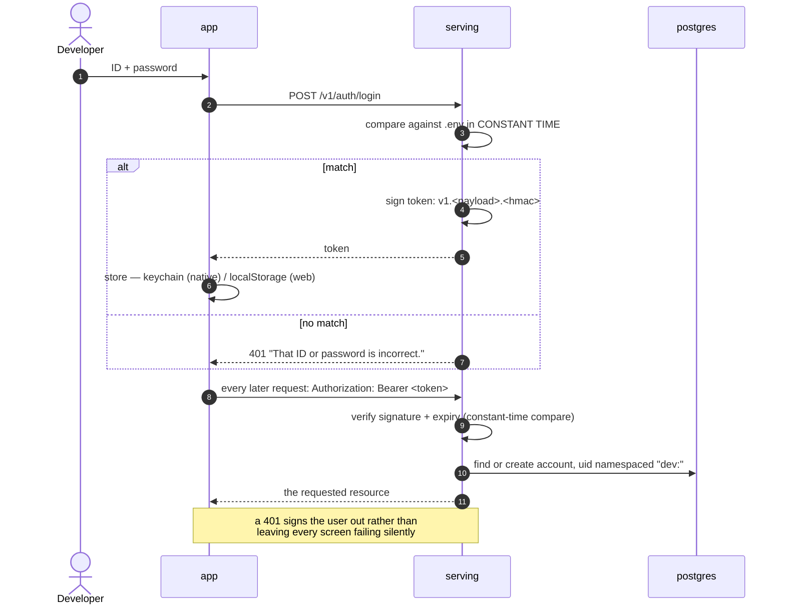

# 04 — Sequences

Six things that happen, in order. These are the diagrams to read when you want to know *what actually runs* on a tap.

---

## 4.1 Cold start — a field nobody has asked for

The expensive path. Note where the request returns: long before any card exists.

**What to notice.** The user-facing request does four cheap database operations and returns. Everything expensive happens after it, in two workers that do not know about each other. Cards appear **per topic**, not per field, so a cold field becomes usable long before it is finished.

---

## 4.2 Cache hit — the whole thesis in one diagram

**What to notice.** This is the acceptance test of the entire design (`tests/reuse.test.ts`), and it was **seen failing with reuse disabled**. The threshold `0.955` is deliberately strict: it was chosen as the lowest cutoff with *zero* false merges over 44 labelled pairs, keeping 67% reuse. The system would rather regenerate a duplicate than show you a card about the wrong thing.

---

## 4.3 Reading, paging and view logging — where the data is easiest to corrupt

**What to notice.** There is **no cursor**. "The next page" means "cards this account has not viewed", so the view log *is* the pagination state. A lost view hands the same card out again; an invented view silently burns a card the user never saw. Both happened, and neither raised an error — see P38.

---

## 4.4 "More topics" — the only user-triggered generation

**What to notice.** Generation is never triggered by paging or polling — only by an explicit tap (P16, P17). `topics_linked` exists because a field can gain cards *without generating anything*, and without counting that, the action would be offered forever.

---

## 4.5 The outbox — why a vector write cannot lose a topic

**What to notice.** Qdrant killed mid-drain was tested: the row retried, kept its error, the worker survived, and the vector appeared on restart. Rows a dead worker stranded are reaped. Rows that exhaust their retries are dead-lettered — and reconciliation, which sweeps both directions, then carries what the fast path gave up on.

---

## 4.6 Login

**What to notice.** Before this existed, `AUTH_MODE=dev` trusted any bearer token *as* the identity — so a login screen on top of it would have been decoration. Google sign-in becomes a second branch that yields an identity into the same `requireAccount`; nothing else changes. **Known gaps:** no rate limiting, and the web token lives in `localStorage`. This mode is for one machine and must be replaced before anything is network-reachable.
