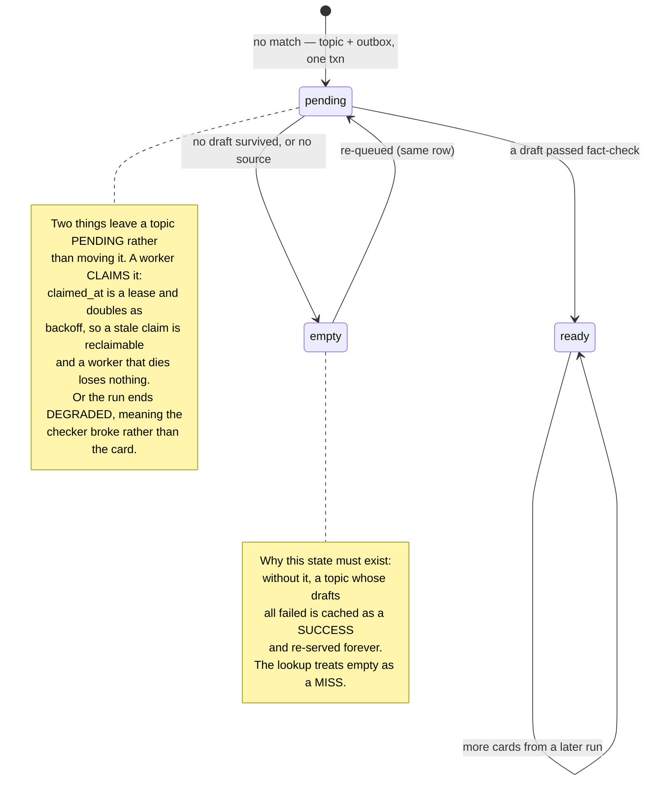
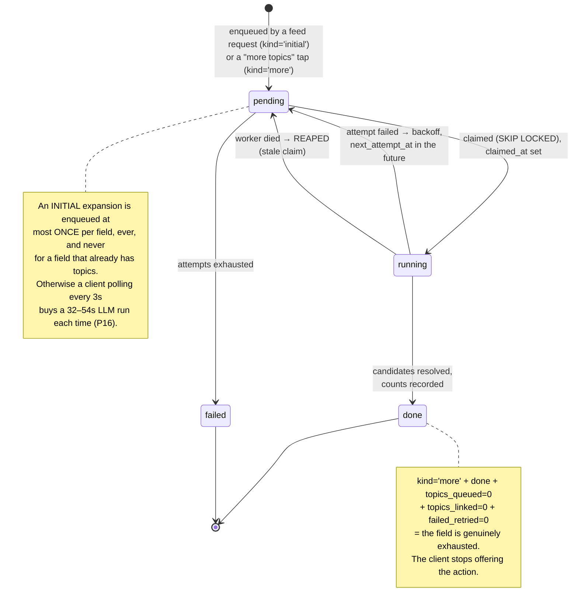
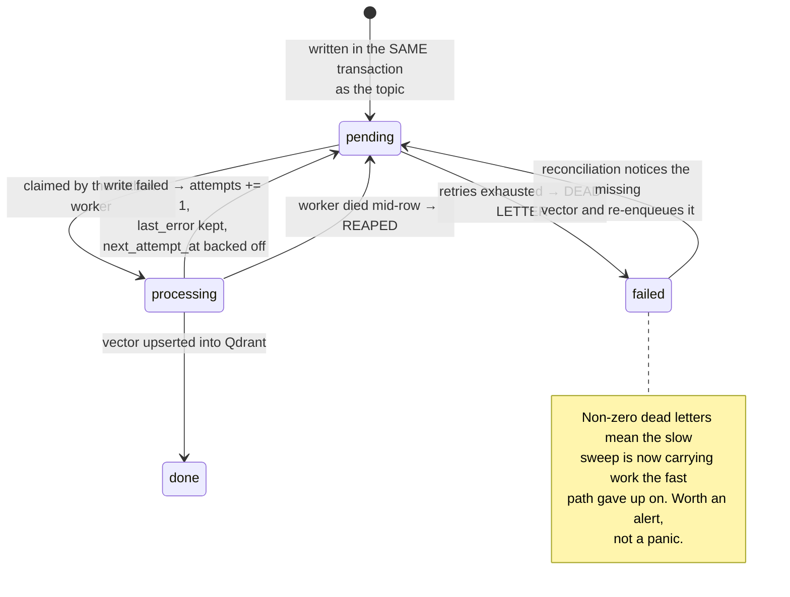
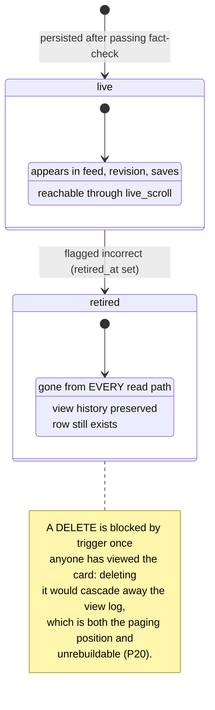

# 05 — State machines

Five things in this system have states, and each state exists because collapsing it into another one caused a bug.

---

## 5.1 Topic — the most important three words in the schema

**Three ways a topic ends with no cards, deliberately kept apart:**

| Outcome | What failed | Topic left as | Drafts quarantined? |
|---|---|---|---|
| `unsourced` | no source could ground it | `empty` | no drafts existed |
| `empty` | every draft was rejected | `empty` | yes, with reasons |
| `degraded` | **the checker itself** errored | `pending` | **no** |

Collapsing these into "no cards" would report a 100% rejection rate for a broken gate and send someone to fix the generator — which is exactly what P10 and P29 were about.

---

## 5.2 Field expansion — candidate generation as a job

A partial failure while resolving finishes the job rather than regenerating: 32–54s of LLM output has already been paid for, and throwing it away to retry one candidate is the expensive kind of tidy.

---

## 5.3 Outbox row — owed vectors

Reconciliation is **asymmetric on purpose**: a vector missing from Qdrant is re-enqueued (wasteful, safe), an orphan vector in Qdrant is deleted (a stale hit would be corruption).

---

## 5.4 Scroll — retire, never delete

---

## 5.5 The feed page, as the client sees it

```mermaid
stateDiagram-v2
    [*] --> loading : first request in flight

    loading --> reading : cards arrived
    loading --> waiting : zero cards, generating:true
    loading --> finished : zero cards, exhausted:true

    reading --> reading : J / swipe → next card;<br/>view logged after 600ms
    reading --> waiting : ran out of cards in hand,<br/>field still generating
    reading --> finished : ran out, nothing on the way

    waiting --> reading : a poll returned new cards<br/>(they take the CURRENT index —<br/>no scroll position to snap back to)
    waiting --> finished : expansion done, nothing produced

    finished --> waiting : "More topics" tapped
    finished --> revision : "Revise this field"
    finished --> [*] : "Go to a related field"

    revision --> revision : seen cards, oldest first,<br/>never exhausted

    note right of finished
        The feed NEVER silently loops back to
        the start. Continuing is always one of
        three explicit actions — that is the
        engagement pattern streaks were
        excluded to avoid (P8).
    end note
```

**What to notice.** `waiting` and `finished` look identical to a careless client — both are "no cards" — and conflating them shows the end-of-field card to someone whose field is 30 seconds old. That is why `generating` and `exhausted` are separate flags rather than one enum, and why an *owed* expansion counts toward `generating`.
