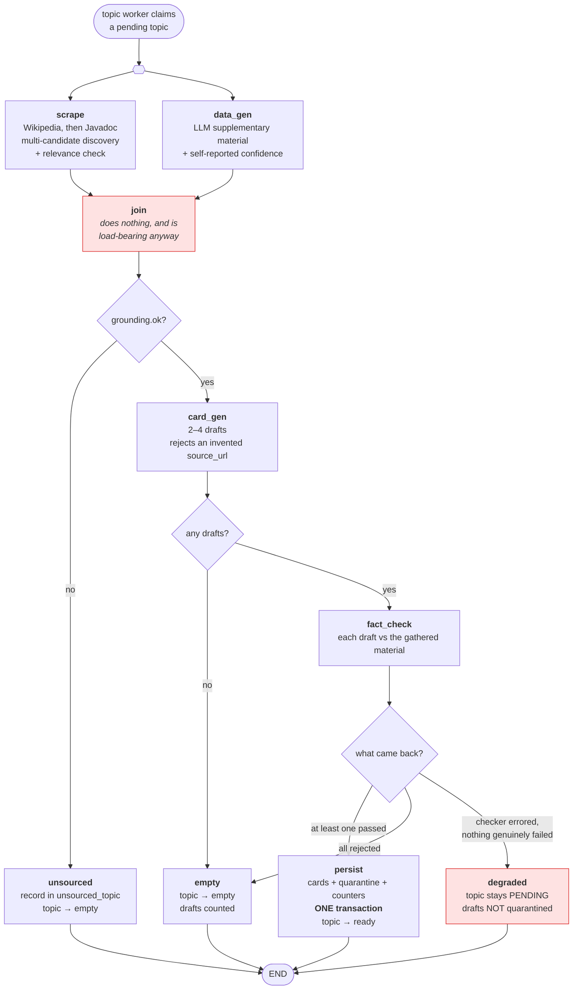
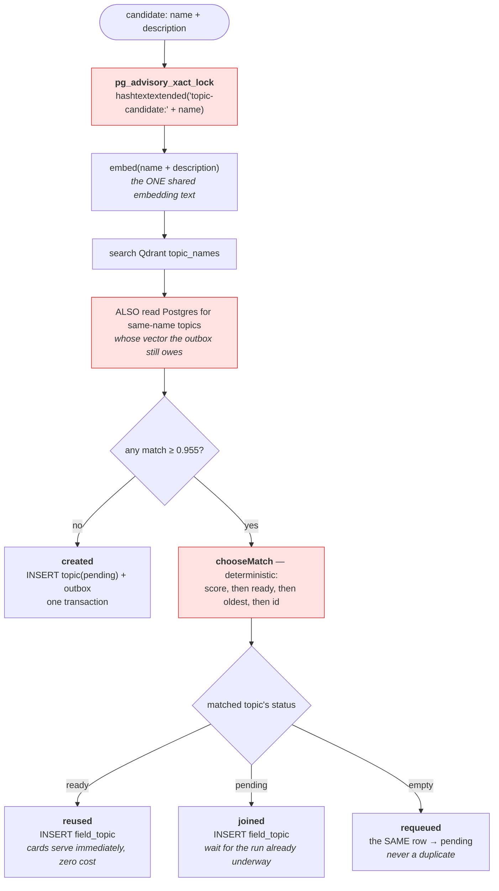
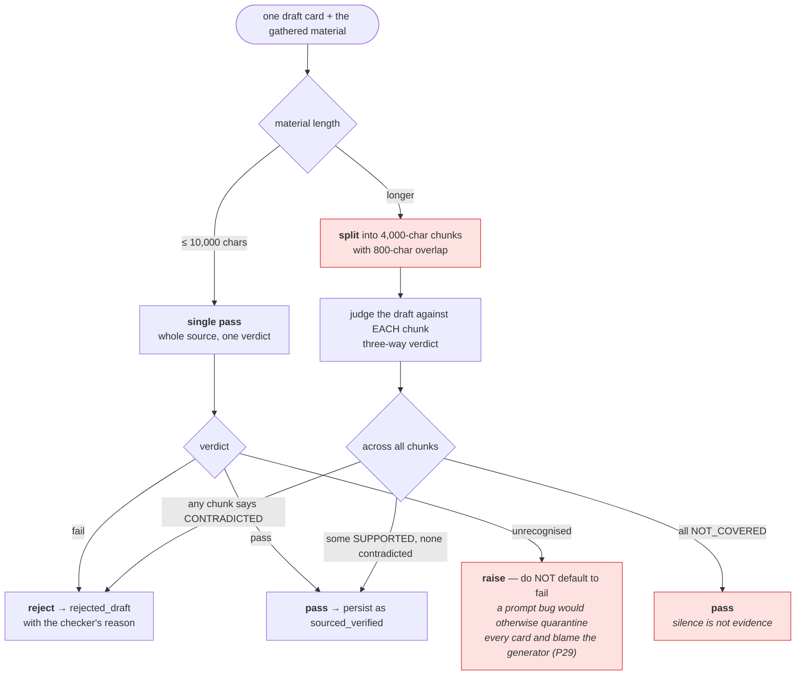
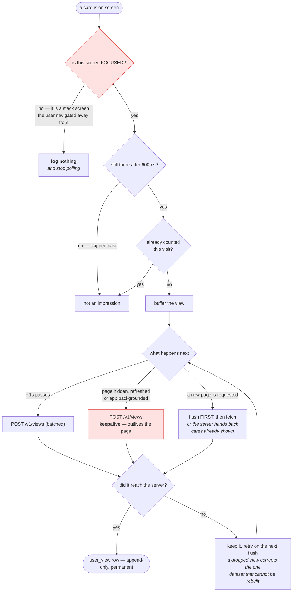

# 06 — Activity and decision flows

Four decisions, branch by branch. Each of these has a bug behind it: the shape of the flow *is* the fix.

---

## 6.1 The generation graph — five steps, one real branch, four endings

**Why `join` exists (P30).** LangGraph fires a node when **any** inbound edge fires, not when all of them do. With the branch hanging off `scrape` directly, routing to `unsourced` did not stop `data_gen`'s edge from firing `card_gen` — so an **ungrounded topic still produced cards**, built from LLM material with no source, and reported itself `ready`. Invariant 4 broken by orchestration while every agent behaved perfectly. The no-op node gives the branch a single place to fire from.

It was caught by a test written *because the join semantics were uncertain*, which asserts which steps did **not** run. Tests that assert absence are rare and were worth it here.

---

## 6.2 Topic resolution — the four outcomes

**Each red box was seen failing with it removed** (P35):

| Removed | Result |
|---|---|
| the lock | 8 simultaneous requests → **8 topics** |
| the Postgres same-name read | 8 simultaneous requests → **8 topics again**, because Qdrant cannot see a vector the outbox has not written |
| deterministic `chooseMatch` | two fields link *different copies*, and the reuse guarantee stops holding without any error |

The middle row is the valuable one. With the lock held, the run took 1,433ms — the requests genuinely serialised — and *still* produced eight duplicates. That turned "a lock around a read of an eventually-consistent store serialises nothing that matters" from an argument into a measurement.

---

## 6.3 Fact-checking a long source — chunked, never truncated

**Why this shape (P33).** Ollama defaults `num_ctx` to 4096 and **silently truncates an over-long prompt from the front** — where the card sits. The gate had been approving cards it was never shown: 11 of 20 in one run, stamped `sourced_verified`. Detection of planted errors went **0/3 → 7/7** once chunked, with faithful controls still passing.

**Why "only contradiction is decisive."** Running the single-pass prompt per chunk would reject nearly every card, because absence from one fragment is not evidence of falsehood. Silence must never reject.

**Why excerpt size and single-pass size are separate budgets** (10,000 vs 4,000): a 10k excerpt diluted attention enough that the model called an *inverted* claim "supported".

---

## 6.4 Logging a view, client-side — where two silent bugs lived

**Both red boxes are P38**, found from one user report — "the deck always refreshes from 0".

- **Without `keepalive` and the hidden-page flush:** a refresh or closed tab runs no unmount, the buffered view dies with the page, and the server correctly hands the same card back as card 01 next visit. Reproduced: card shown 1.2s, refresh, same card returned, no request sent.
- **Without the focus check:** every feed screen ever opened stayed mounted — `Esc` pushed a *new* Home rather than going back — each keeping its keydown listener and display timer. One press of J logged a card in every hidden copy. The log holds the same card **eight times at an identical millisecond**. The account consumed a 91-card field in twenty minutes of work that displayed a handful.

The two faults corrupted the same append-only dataset in opposite directions, and neither raised an error anywhere.
